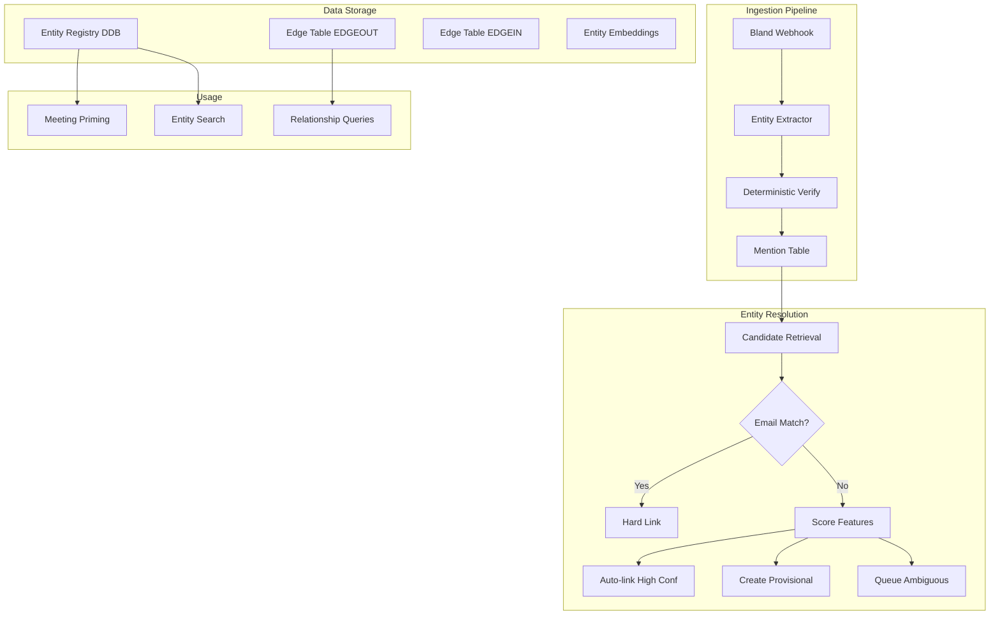

# Slice 3: Personal Knowledge Graph

## Overview

Implement a grounded personal knowledge graph with entity extraction, evidence-backed relationships, and progressive entity resolution. Start with DynamoDB, add vector search, design for Neptune migration later.

## Architecture Overview



---

## Data Model (DynamoDB)

### Design Decisions (Fixes Applied)

1. **Meetings are NOT entities** - `meeting_id` is stored as a property on edges/mentions, not as a node type
2. **Separate mention state from entity state** - mentions have `resolution_state`, entities have `status`
3. **Email match = hard deterministic link** - skip scoring entirely if email matches
4. **Dual-write edges** - EDGEOUT and EDGEIN for bidirectional queries
5. **Evidence capped** - max 10 evidence items on entities; full evidence lives on mentions/edges
6. **Timestamps required** - extraction must provide `t0`/`t1` or `segment_id`

---

### Table: `kairos-entities`

| Key | Description |
|-----|-------------|
| PK: `USER#<user_id>` | Partition by user |
| SK: `ENTITY#<entity_id>` | Entity identifier (UUID) |

**Attributes:**
```
type: Person | Organization | Project | Decision | Task
display_name: "Sam"
canonical_name: "Samuel Johnson" (optional, user-confirmed)
primary_email: string (nullable) - deterministic identifier for Person
aliases: ["Sam", "Samuel", "sam@acme.com"]
status: resolved | provisional
  - resolved: has a strong identifier (email) or user-confirmed
  - provisional: created from mentions, awaiting confirmation
profile_embedding_id: string (pointer to vector store, nullable)
top_evidence: [max 10 items] - {meeting_id, quote, t0, t1, type}
mention_count: number
edge_count: number
created_at: ISO8601
updated_at: ISO8601
```

**GSI1** (for listing entities by type):
- GSI1PK: `USER#<user_id>#TYPE#<type>`
- GSI1SK: `ENTITY#<entity_id>`

---

### Table: `kairos-mentions`

| Key | Description |
|-----|-------------|
| PK: `USER#<user_id>` | Partition by user |
| SK: `MENTION#<meeting_id>#<segment_id>#<hash>` | Unique mention |

**Attributes:**
```
mention_text: string - exact text as spoken
type: Person | Organization | Project | Decision
local_context: string - 1-2 surrounding sentences
evidence:
  meeting_id: string
  segment_id: string (or t0/t1 timestamps)
  t0: number (seconds from start)
  t1: number (seconds from end)
  quote: string - exact substring from transcript (verified)
role_hint: string (nullable) - "CFO", "recruiter", etc.
resolution_state: linked | ambiguous | new_entity_created
  - linked: successfully matched to existing entity
  - ambiguous: multiple candidates, awaiting resolution
  - new_entity_created: no match, created new provisional entity
linked_entity_id: string (nullable) - final linked entity
candidate_entity_ids: [string] - possible matches (for ambiguous)
confidence: number 0.0-1.0
extractor_version: string - model version for reproducibility
verified: boolean - passed deterministic validation
created_at: ISO8601
```

**GSI1** (for listing mentions by entity):
- GSI1PK: `USER#<user_id>#ENTITY#<entity_id>`
- GSI1SK: `MENTION#<meeting_id>#<segment_id>`

---

### Table: `kairos-edges`

Dual-write pattern for bidirectional queries.

**Outgoing edges:**
| Key | Description |
|-----|-------------|
| PK: `USER#<user_id>` | Partition by user |
| SK: `EDGEOUT#<from_entity_id>#<edge_type>#<to_entity_id>` | Outgoing edge |

**Incoming edges (same data, reverse direction):**
| Key | Description |
|-----|-------------|
| PK: `USER#<user_id>` | Partition by user |
| SK: `EDGEIN#<to_entity_id>#<edge_type>#<from_entity_id>` | Incoming edge |

**Attributes (on both items):**
```
edge_type: MENTIONED_IN | WORKS_AT | WORKS_ON | OWNS | RELATES_TO | INTRODUCED
from_entity_id: string
to_entity_id: string
meeting_id: string - the meeting where this was established
properties:
  label: string (for RELATES_TO: "advisor", "cofounder", "investor")
  introduced_by: entity_id (for INTRODUCED)
evidence: [max 5 items]
  - meeting_id: string
  - quote: string
  - t0: number
  - t1: number
confidence: number 0.0-1.0
verified: boolean
created_at: ISO8601
updated_at: ISO8601
```

**Why dual-write:**
- Query "all edges FROM entity X": `SK begins_with EDGEOUT#<entity_id>`
- Query "all edges TO entity X": `SK begins_with EDGEIN#<entity_id>`
- Both patterns are efficient with a single table

---

### Table: `kairos-entity-evidence` (overflow)

For entities with many evidence items, store overflow here.

| Key | Description |
|-----|-------------|
| PK: `USER#<user_id>#ENTITY#<entity_id>` | Entity reference |
| SK: `EVIDENCE#<timestamp>#<hash>` | Evidence item |

**Attributes:**
```
meeting_id: string
quote: string
t0: number
t1: number
evidence_type: mention | edge | user_confirmed
confidence: number
created_at: ISO8601
```

---

## Entity Resolution Pipeline

### State Machine

```
Mention States:
  - linked: matched to entity (high confidence or email match)
  - ambiguous: multiple candidates (score between thresholds)
  - new_entity_created: no candidates, created provisional entity

Entity States:
  - resolved: has email identifier OR user-confirmed
  - provisional: created from mentions, awaiting strong identifier
```

### Resolution Algorithm

```python
def resolve_mention(mention, user_id):
    # Step 0: Deterministic email match (HARD LINK)
    if mention.has_attendee_email():
        entity = get_or_create_by_email(user_id, mention.email, mention.name)
        return link_mention(mention, entity, confidence=1.0, state="linked")
    
    # Step 1: Retrieve candidates with rich context
    candidates = get_candidates(
        user_id=user_id,
        mention_text=mention.text,
        meeting_id=mention.meeting_id,
        attendee_emails=mention.meeting_attendees,
        local_context=mention.local_context,
        role_hint=mention.role_hint,
    )
    
    # Step 2: Score each candidate
    scores = []
    for candidate in candidates:
        score = score_candidate(mention, candidate)
        scores.append((candidate, score))
    
    best_candidate, best_score = max(scores, key=lambda x: x[1]) if scores else (None, 0)
    
    # Step 3: Apply thresholds
    if best_score >= 0.85:  # HIGH threshold
        return link_mention(mention, best_candidate, confidence=best_score, state="linked")
    elif best_score <= 0.30:  # LOW threshold
        entity = create_provisional_entity(mention)
        return link_mention(mention, entity, confidence=1.0, state="new_entity_created")
    else:
        # Ambiguous - store candidates, don't create entity
        return mark_ambiguous(mention, candidates, scores)
```

### Scoring Function

```python
def score_candidate(mention, candidate):
    """
    Score how likely this mention refers to this candidate entity.
    Email matches are handled upstream (hard link), so not included here.
    Returns: float 0.0 - 1.0
    """
    score = 0.0
    
    # Name/alias similarity (Jaro-Winkler or similar)
    name_sim = fuzzy_match(mention.text, candidate.aliases)
    score += name_sim * 0.25
    
    # Attendee overlap (same people in meeting)
    attendee_overlap = jaccard(mention.meeting_attendees, candidate.recent_attendees)
    score += attendee_overlap * 0.25
    
    # Organization overlap (same company mentioned)
    if mention.org_hint and candidate.organization:
        if fuzzy_match(mention.org_hint, candidate.organization) > 0.8:
            score += 0.20
    
    # Role/title match
    if mention.role_hint and candidate.role:
        if fuzzy_match(mention.role_hint, candidate.role) > 0.8:
            score += 0.15
    
    # Temporal proximity (recent mentions cluster)
    days_since_last = days_between(mention.timestamp, candidate.last_seen)
    if days_since_last <= 7:
        score += 0.10
    elif days_since_last <= 30:
        score += 0.05
    
    # Embedding similarity (if available)
    if mention.embedding and candidate.profile_embedding:
        cos_sim = cosine_similarity(mention.embedding, candidate.profile_embedding)
        score += cos_sim * 0.05
    
    return min(score, 1.0)  # Cap at 1.0
```

### Candidate Retrieval

```python
def get_candidates(user_id, mention_text, meeting_id, attendee_emails, local_context, role_hint):
    """
    Retrieve candidate entities that could match this mention.
    Uses multiple signals, not just the name string.
    """
    candidates = set()
    
    # 1. Alias/name match (fuzzy)
    candidates.update(
        query_entities_by_alias(user_id, mention_text, threshold=0.7)
    )
    
    # 2. Attendee email matches (if "Sam" is an attendee with email)
    for email in attendee_emails:
        entity = get_entity_by_email(user_id, email)
        if entity:
            candidates.add(entity)
    
    # 3. Recent/proximal entities in same meetings
    recent_entities = get_entities_in_recent_meetings(user_id, meeting_id, days=30)
    for entity in recent_entities:
        if fuzzy_match(mention_text, entity.aliases) > 0.5:
            candidates.add(entity)
    
    # 4. (Later) Embedding similarity
    # candidates.update(vector_search(mention_embedding, top_k=5))
    
    return list(candidates)
```

---

## Extraction and Verification Pipeline

### Step 1: Extract (LLM)

**Prompt:**
```
Extract all named entities from this meeting transcript.

For each entity, provide a JSON object with:
- mention_text: exactly as it appears in the transcript
- type: Person | Organization | Project | Decision
- role_hint: any role/title mentioned (e.g., "CFO", "recruiter") or null
- quote: the EXACT sentence containing the mention (copy verbatim)
- t0: start timestamp in seconds (from transcript timestamps)
- t1: end timestamp in seconds

RULES:
- Only extract entities you can ground with a direct quote
- The quote MUST appear verbatim in the transcript
- Do not infer relationships or roles not explicitly stated
- Include timestamps from the transcript markers

Transcript:
{transcript_with_timestamps}

Output JSON array:
```

### Step 2: Verify (Deterministic)

```python
def verify_extraction(extraction, transcript):
    """
    Deterministic verification that extraction is grounded.
    Returns (is_valid, errors)
    """
    errors = []
    
    # 1. Quote must appear in transcript (exact substring)
    if extraction.quote not in transcript:
        errors.append("quote_not_found")
    
    # 2. Mention text must appear in quote
    if extraction.mention_text.lower() not in extraction.quote.lower():
        errors.append("mention_not_in_quote")
    
    # 3. Role hint (if present) must appear in quote
    if extraction.role_hint:
        if extraction.role_hint.lower() not in extraction.quote.lower():
            errors.append("role_hint_not_in_quote")
    
    # 4. Timestamps must be valid
    if extraction.t0 < 0 or extraction.t1 < extraction.t0:
        errors.append("invalid_timestamps")
    
    return len(errors) == 0, errors
```

### Step 3: Verify Relationships (LLM Entailment - Optional)

For high-stakes edges like WORKS_AT, RELATES_TO, INTRODUCED:

```python
def verify_relationship(quote, from_entity, to_entity, relationship_type):
    """
    LLM verification that the quote actually supports the relationship.
    """
    prompt = f"""
    Does this quote support the claim that "{from_entity}" {relationship_type} "{to_entity}"?
    
    Quote: "{quote}"
    Claim: {from_entity} {relationship_type} {to_entity}
    
    Answer YES or NO with a brief explanation.
    """
    response = llm.complete(prompt)
    return "YES" in response.upper()
```

---

## Edge Types

| Edge Type | From | To | Description | Requires Verification |
|-----------|------|-----|-------------|----------------------|
| MENTIONED_IN | Entity | (meeting_id as property) | Entity mentioned in transcript | Deterministic only |
| WORKS_AT | Person | Organization | Employment relationship | LLM entailment |
| WORKS_ON | Person | Project | Project involvement | LLM entailment |
| OWNS | Person | Task/Decision | Responsibility | Deterministic |
| RELATES_TO | Person | Person | Relationship with label | LLM entailment |
| INTRODUCED | Person | Person | Who introduced whom | LLM entailment |

**Note:** ATTENDED edges are created directly from calendar data (deterministic via attendee email), not from transcript extraction.

---

## Implementation Phases

### Phase 3A: Data Model and Attendee Enrichment

- [ ] Create `kairos-entities` DynamoDB table with GSI1
- [ ] Create `kairos-mentions` DynamoDB table with GSI1
- [ ] Create `kairos-edges` DynamoDB table (dual-write pattern)
- [ ] Create `kairos-entity-evidence` overflow table
- [ ] Add CDK resources for all tables
- [ ] Create `AttendeeInfo` model: `{name: str, email: str | None}`
- [ ] Update `Meeting` model to use `attendees: list[AttendeeInfo]`
- [ ] Update `extract_attendee_names` → `extract_attendees` returning full info
- [ ] Update `meetings_repo.py` to store/retrieve attendee objects

### Phase 3B: Entity Repository

- [ ] Create `src/adapters/entities.py`:
  - `EntityRepository.get_or_create_by_email(user_id, email, name)` - deterministic
  - `EntityRepository.get_by_id(user_id, entity_id)`
  - `EntityRepository.get_candidates(user_id, query: CandidateQuery)` - rich context
  - `EntityRepository.create_provisional(user_id, mention)` - from unmatched mention
  - `EntityRepository.link_mention(mention_id, entity_id, confidence)`
  - `EntityRepository.add_alias(entity_id, alias)`
  - `EntityRepository.merge_entities(from_id, to_id)` - with audit log
- [ ] Create `src/adapters/edges.py`:
  - `EdgeRepository.create_edge(user_id, from_id, to_id, edge_type, evidence)` - dual-write
  - `EdgeRepository.get_edges_from(user_id, entity_id)` - outgoing
  - `EdgeRepository.get_edges_to(user_id, entity_id)` - incoming
  - `EdgeRepository.get_all_edges_for(user_id, entity_id)` - both directions

### Phase 3C: Entity Extraction

- [ ] Create `src/core/entity_extractor.py`:
  - Extraction prompt with timestamps
  - Output: list of `MentionExtraction` with grounded quotes
- [ ] Create `src/core/extraction_verifier.py`:
  - `verify_extraction(extraction, transcript)` - deterministic checks
  - `verify_relationship(quote, from_entity, to_entity, type)` - LLM entailment
- [ ] Add Pydantic models: `MentionExtraction`, `VerificationResult`

### Phase 3D: Resolution Pipeline

- [ ] Create `src/core/resolution.py`:
  - `resolve_mention(mention, user_id)` - main algorithm
  - `score_candidate(mention, candidate)` - weighted scoring
  - `get_candidates(...)` - rich retrieval
- [ ] Integrate into `webhook.py` `_handle_successful_call`:
  - After summarization: extract entities
  - Verify extractions (reject ungrounded)
  - Run resolution pipeline
  - Create edges for linked entities

### Phase 3E: Calendar Attendee Auto-Resolution

- [ ] In `calendar_webhook.py`:
  - For each attendee with email: `get_or_create_by_email`
  - Create ATTENDED property on meeting (not as edge - meeting isn't a node)
  - Store `attendee_entity_ids[]` on Meeting for quick lookup

### Phase 3F: User Confirmation Loop (Later)

- [ ] Design confirmation API for ambiguous mentions
- [ ] Bundle ambiguities: "Is 'Sam' from today's call Sam (CFO) or Sam (Recruiter)?"
- [ ] Store user confirmations as high-confidence evidence
- [ ] Promote provisional → resolved on confirmation

### Phase 3G: Vector Embeddings (Later)

- [ ] Generate entity profile embeddings from aggregated mentions
- [ ] Store in OpenSearch Serverless or pgvector
- [ ] Use for fuzzy entity search and candidate retrieval

---

## Key Files to Create/Modify

| File | Purpose |
|------|---------|
| `src/core/models.py` | Add Entity, Mention, Edge, AttendeeInfo, MentionExtraction models |
| `src/core/entity_extractor.py` | LLM-based mention extraction with timestamps |
| `src/core/extraction_verifier.py` | Deterministic + LLM verification |
| `src/core/resolution.py` | Candidate scoring and threshold logic |
| `src/adapters/entities.py` | Entity CRUD, merge/split, alias management |
| `src/adapters/edges.py` | Dual-write edge operations |
| `src/adapters/google_calendar.py` | Update to return AttendeeInfo |
| `src/adapters/meetings_repo.py` | Store attendee objects |
| `src/handlers/webhook.py` | Add extraction + resolution after summarization |
| `src/handlers/calendar_webhook.py` | Auto-create entities from attendees |
| `cdk/kairos_stack.py` | Add new DynamoDB tables |

---

## Safeguards

1. **No edge without evidence** - every relationship must cite transcript segment
2. **No role without evidence** - roles extracted only if verbatim in quote
3. **Deterministic verification** - quote must appear in transcript, mention in quote
4. **LLM entailment verification** - for relationship edges (WORKS_AT, RELATES_TO, etc.)
5. **Confidence thresholds** - only high-confidence facts used for meeting priming
6. **Separate mention/entity states** - ambiguous mentions don't create entities
7. **Provisional entities** - only created when score <= LOW (no match)
8. **Email = hard link** - bypasses scoring entirely
9. **Evidence capped** - max 10 on entity, overflow to separate table
10. **Merge/split audit log** - track all entity merges for debugging

---

## Success Criteria

- [ ] Calendar attendees auto-create Person entities with email as canonical ID
- [ ] Transcript mentions extracted with grounded quotes and timestamps
- [ ] Deterministic verification rejects ungrounded extractions
- [ ] Email matches result in hard links (100% confidence)
- [ ] High-confidence mentions (>= 0.85) auto-linked
- [ ] Ambiguous mentions (0.31-0.84) stored with candidates, no entity created
- [ ] Low-confidence mentions (<= 0.30) create provisional entities
- [ ] Edges queryable in both directions efficiently
- [ ] Evidence capped at 10 per entity with overflow handling
