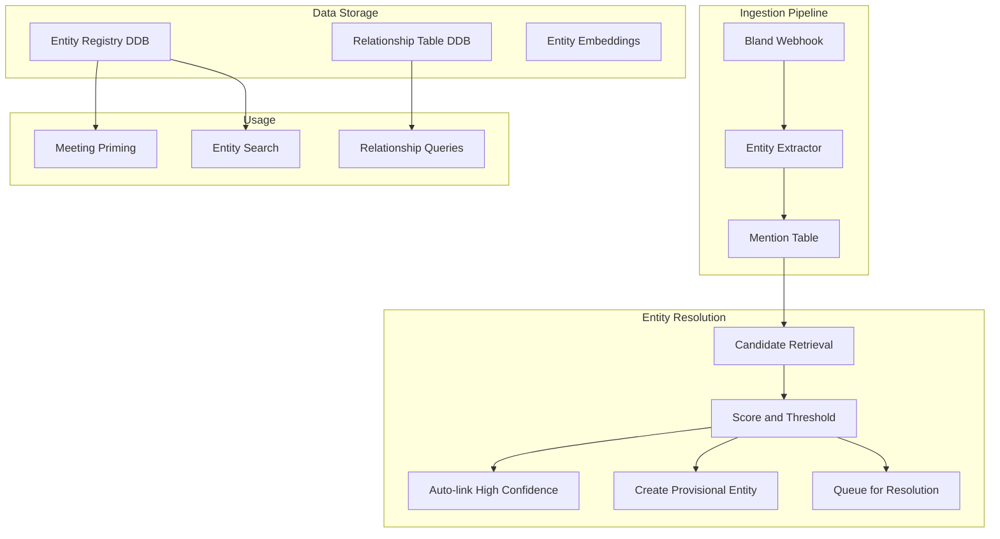

# Slice 3: Personal Knowledge Graph

## Overview

Implement a grounded personal knowledge graph with entity extraction, evidence-backed relationships, and progressive entity resolution. Start with DynamoDB, add vector search, design for Neptune migration later.

## Architecture Overview



## Data Model (DynamoDB)

### Table: `kairos-entities`

| Key | Description |
|-----|-------------|
| PK: `USER#<user_id>` | Partition by user |
| SK: `ENTITY#<entity_id>` | Entity identifier |

**Attributes:**
- `type`: Person / Organization / Project / Decision / Task
- `display_name`: "Sam"
- `canonical_name`: "Samuel Johnson" (optional)
- `primary_email`: deterministic identifier for Person
- `aliases[]`: ["Sam", "Samuel"]
- `resolution_status`: resolved / provisional / ambiguous
- `profile_embedding_id`: pointer to vector store
- `evidence[]`: list of {meeting_id, quote, timestamp}
- `created_at`, `updated_at`

### Table: `kairos-mentions`

| Key | Description |
|-----|-------------|
| PK: `USER#<user_id>` | Partition by user |
| SK: `MENTION#<meeting_id>#<timestamp>#<hash>` | Unique mention |

**Attributes:**
- `mention_text`: exact text as spoken
- `type`: Person / Organization / Project / Decision
- `local_context`: 1-2 surrounding sentences
- `evidence`: {meeting_id, t0, t1, quote}
- `candidate_entity_ids[]`: possible matches
- `linked_entity_id`: final linked entity (nullable)
- `confidence`: 0.0 - 1.0
- `extractor_version`: model version for reproducibility
- `role_hint`: "CFO", "recruiter", etc. (optional)

### Table: `kairos-edges`

| Key | Description |
|-----|-------------|
| PK: `USER#<user_id>` | Partition by user |
| SK: `EDGE#<from_id>#<type>#<to_id>` | Relationship |

**Attributes:**
- `edge_type`: ATTENDED / MENTIONED_IN / WORKS_AT / WORKS_ON / OWNS / RELATES_TO / INTRODUCED
- `properties`: edge-specific data (e.g., relationship label)
- `evidence[]`: list of {meeting_id, quote, timestamp}
- `confidence`: 0.0 - 1.0
- `created_at`

**GSI:** `GSI1PK: USER#<user_id>#ENTITY#<entity_id>` for querying all edges involving an entity.

---

## Implementation Phases

### Phase 3A: Data Model and Attendee Enrichment

- [ ] Create `kairos-entities`, `kairos-mentions`, `kairos-edges` DynamoDB tables in CDK
- [ ] Update Meeting model (`src/core/models.py`) to store `attendees` as list of `{name, email}` objects instead of just strings
- [ ] Update `extract_attendee_names` (`src/adapters/google_calendar.py`) to return `AttendeeInfo` with both name and email
- [ ] Create `entities.py` adapter with:
  - `EntityRepository.get_or_create_by_email(user_id, email, name)` - deterministic lookup/create
  - `EntityRepository.get_candidates(user_id, mention_text)` - fuzzy candidate retrieval
  - `EntityRepository.link_mention(mention_id, entity_id, confidence)`

### Phase 3B: Entity Extraction from Transcripts

- [ ] Create `entity_extractor.py` in `src/core/`:
  - LLM prompt to extract mentions from transcript with evidence (quote, type, role_hint)
  - Output: list of `MentionExtraction` objects with grounded quotes
- [ ] Extend `webhook.py` `_handle_successful_call`:
  - After summarization, run entity extraction on transcript
  - Store mentions in `kairos-mentions` table
  - For each mention, run candidate retrieval and scoring

### Phase 3C: Entity Resolution Pipeline

- [ ] Create `resolution.py` in `src/core/`:
  - `score_candidate(mention, candidate_entity)` - compute match score from:
    - Email match (1.0 if exact)
    - Name/alias match (fuzzy string similarity)
    - Attendee overlap (same meeting participants)
    - Organization overlap
    - Embedding similarity (if available)
  - Thresholds: `HIGH >= 0.85` (auto-link), `LOW <= 0.3` (new entity), else ambiguous
- [ ] For auto-linked mentions: create edges (ATTENDED, MENTIONED_IN)
- [ ] For ambiguous mentions: store as provisional entity with evidence

### Phase 3D: Calendar Attendee Auto-Resolution

- [ ] In `calendar_webhook.py`:
  - When syncing meetings, auto-create/link Person entities for attendees with emails
  - Create ATTENDED edges with meeting as evidence
  - This gives you a baseline graph just from calendar sync (before any calls)

### Phase 3E: User Confirmation Loop (Later)

- [ ] Design confirmation API/interface for ambiguous entities
- [ ] Bundle ambiguities: "Is 'Sam' from today's call Sam (CFO) or Sam (Recruiter)?"
- [ ] Store user confirmations as high-confidence evidence

### Phase 3F: Vector Embeddings (Later)

- [ ] Generate entity profile embeddings from aggregated mentions
- [ ] Store in OpenSearch Serverless or pgvector
- [ ] Use for fuzzy entity search and candidate retrieval

---

## Key Files to Create/Modify

| File | Purpose |
|------|---------|
| `src/core/entity_extractor.py` | LLM-based mention extraction with evidence |
| `src/core/resolution.py` | Candidate scoring and threshold logic |
| `src/adapters/entities.py` | DynamoDB operations for entities/mentions/edges |
| `src/core/models.py` | Add `Entity`, `Mention`, `Edge`, `AttendeeInfo` models |
| `src/handlers/webhook.py` | Add entity extraction after summarization |
| `src/handlers/calendar_webhook.py` | Auto-create entities from attendees |
| `cdk/kairos_stack.py` | Add new DynamoDB tables |

---

## Entity Extraction Prompt (Draft)

```
Extract all named entities from this meeting transcript.

For each entity, provide:
- mention_text: exactly as it appears
- type: Person, Organization, Project, or Decision
- role_hint: any role/title mentioned (e.g., "CFO", "recruiter")
- quote: the exact sentence containing the mention (evidence)

Only extract entities you can ground with a direct quote. Do not infer.

Transcript:
{transcript}
```

---

## Safeguards

1. **No edge without evidence** - every relationship must cite transcript/meeting
2. **No role without evidence** - roles are extracted, not inferred
3. **Confidence thresholds** - only high-confidence facts used for meeting priming
4. **Provisional entities** - unresolved mentions stay provisional, never force merge
5. **Merge/split log** - track entity merges for audit

---

## Success Criteria

- Calendar attendees auto-create Person entities with email as canonical ID
- Transcript mentions extracted with grounded quotes
- High-confidence mentions auto-linked to entities
- Ambiguous mentions stored as provisional (not forced)
- ATTENDED and MENTIONED_IN edges created with evidence

---

## Core Edge Types

| Edge Type | From | To | Description |
|-----------|------|-----|-------------|
| ATTENDED | Person | Meeting | Person was an attendee |
| MENTIONED_IN | Entity | Meeting | Entity mentioned in transcript |
| WORKS_AT | Person | Organization | Employment relationship |
| WORKS_ON | Person | Project | Project involvement |
| OWNS | Person | Task/Decision | Responsibility |
| RELATES_TO | Person | Person | General relationship (with label) |
| INTRODUCED | Person | Person | Who introduced whom |

---

## Entity Resolution Strategy

### The "Two Sams" Problem

When you first see "Sam" and can't disambiguate:

1. Create `Person: Sam (provisional #1)` with only evidence
2. Link mentions to provisional Sam
3. As soon as you get a strong identifier (calendar email, "Sam at Acme"), either:
   - Merge provisional → resolved entity, or
   - Split provisional into Sam#A and Sam#B and reassign mentions (keep a merge/split log)

This avoids forcing a wrong merge early, which is the most damaging failure mode.

### Scoring Features

| Feature | Weight | Description |
|---------|--------|-------------|
| Email match | 1.0 | Exact email match = certain |
| Attendee overlap | 0.3 | Same people in meeting |
| Organization overlap | 0.2 | Same company mentioned |
| Role/title match | 0.2 | Same role mentioned |
| Name similarity | 0.1 | Fuzzy string match |
| Temporal clustering | 0.1 | Mentions close in time |

### Thresholds

- `>= 0.85`: Auto-link (high confidence)
- `<= 0.30`: Create new entity
- `0.31 - 0.84`: Ambiguous (queue for resolution)

