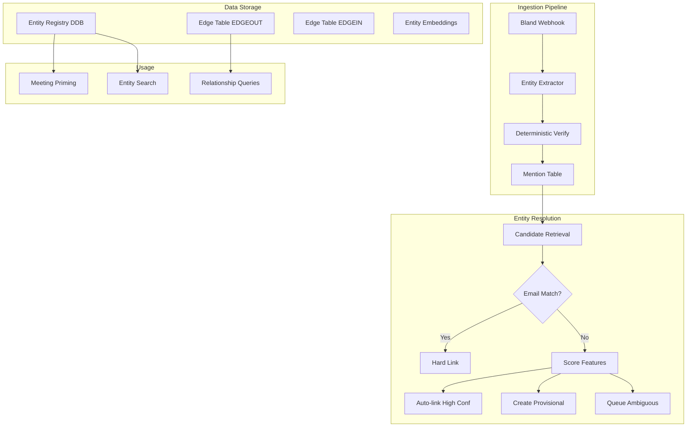

# Slice 3: Personal Knowledge Graph

## Overview

Implement a grounded personal knowledge graph with entity extraction, evidence-backed relationships, and progressive entity resolution. Start with DynamoDB, add vector search, design for Neptune migration later.

---

## Design Conformity Assessment

This design aligns with the "grounded personal graph + progressive resolution" philosophy. Key conformance points:

### Strongly Conforms

1. **Grounded extraction with evidence** - Direct quotes required for extracted mentions; evidence stored on mentions and edges ("No edge without evidence", "No role without evidence").

2. **Progressive entity resolution (don't force merges)** - Create provisional entities when ambiguous and only merge/split later with an audit trail. Safest way to handle duplicate names ("two Sams" problem).

3. **Deterministic IDs when available (email)** - Creating/looking up Person by `primary_email` as a deterministic identifier is the single biggest "make it work" move.

4. **Roadmap sequencing** - DynamoDB first → add embeddings later → design for Neptune later. Right MVP progression.

### Key Design Decisions (Fixes Applied)

| Issue | Fix Applied |
|-------|-------------|
| Meeting edges pointed to non-existent nodes | **Meetings are NOT entities** - `meeting_id` is stored as a property on edges/mentions, not as a node type |
| Tasks/Decisions don't need entity resolution | **Tasks/Decisions are NOT entities** - they're meeting artifacts, stored in summaries, not the knowledge graph |
| "Ambiguous mention" conflated with "provisional entity" | **Separate mention state from entity state** - mentions have `resolution_state`, entities have `status`. Ambiguous mentions don't create entities. |
| Email match was weighted, could be overridden | **Fuzzy attendee match = hard link** - if mention fuzzy-matches exactly one attendee (score >= 0.85, clear winner), skip scoring and link via email |
| "All edges for entity X" was expensive | **Dual-write edges** - EDGEOUT and EDGEIN for bidirectional queries |
| Evidence arrays could grow unbounded | **Evidence capped** - max 10 evidence items on entities; full evidence lives on mentions/edges or overflow table |
| Extraction prompt lacked timestamps | **Timestamps required** - extraction must provide `t0`/`t1` or `segment_id` |
| Candidate retrieval only used name string | **Rich candidate retrieval** - query accepts meeting_id, attendee_emails, local_context, role_hint |
| Alias lookup required scanning all entities | **Inverted alias index** - `kairos-entity-aliases` table enables fast alias → entity lookups |

---

## Architecture Overview



---

## Data Model (DynamoDB)

### Table: `kairos-entities`

| Key | Description |
|-----|-------------|
| PK: `USER#<user_id>` | Partition by user |
| SK: `ENTITY#<entity_id>` | Entity identifier (UUID) |

**Attributes:**
```
type: Person | Organization | Project
display_name: "Sam"
canonical_name: "Samuel Johnson" (optional, user-confirmed)
primary_email: string (nullable) - deterministic identifier for Person
aliases: ["Sam", "Samuel", "sam@acme.com"]
status: resolved | provisional
  - resolved: has a strong identifier (email) or user-confirmed
  - provisional: created from mentions, awaiting confirmation

# Cached/derived fields for scoring (updated on new evidence)
organization: string (nullable) - derived from WORKS_AT edge
role: string (nullable) - most recent role_hint from mentions
recent_meeting_ids: [string, max 10] - meetings where entity appeared recently
recent_attendee_emails: [string] - emails of people in recent_meeting_ids (for overlap scoring)

profile_embedding_id: string (pointer to vector store, nullable)
top_evidence: [max 10 items] - {meeting_id, quote, t0, t1, type}
mention_count: number
edge_count: number
last_seen: ISO8601 - for temporal clustering in scoring
created_at: ISO8601
updated_at: ISO8601
```

**Derived field maintenance:**
- `organization`: Set when WORKS_AT edge is created (from verified extraction)
- `role`: Updated when a mention with role_hint is linked to this entity
- `recent_meeting_ids`: Append on each new mention, keep last 10
- `recent_attendee_emails`: Union of attendee emails from recent_meeting_ids

**GSI1** (for listing entities by type):
- GSI1PK: `USER#<user_id>#TYPE#<type>`
- GSI1SK: `ENTITY#<entity_id>`

**GSI2** (for email lookup - deterministic):
- GSI2PK: `USER#<user_id>#EMAIL#<primary_email>`
- GSI2SK: `ENTITY#<entity_id>`

---

### Table: `kairos-mentions`

| Key | Description |
|-----|-------------|
| PK: `USER#<user_id>` | Partition by user |
| SK: `MENTION#<meeting_id>#<segment_id>#<hash>` | Unique mention |

**Attributes:**
```
mention_text: string - exact text as spoken
type: Person | Organization | Project
local_context: string - 1-2 surrounding sentences
evidence:
  meeting_id: string
  segment_id: string (or t0/t1 timestamps)
  t0: number (seconds from start)
  t1: number (seconds from end)
  quote: string - exact substring from transcript (verified)
role_hint: string (nullable) - "CFO", "recruiter", etc.
org_hint: string (nullable) - organization mentioned in same context (e.g., "Acme Corp")
meeting_attendee_emails: [string] - attendees of the meeting (for overlap scoring)
resolution_state: linked | ambiguous | new_entity_created
  - linked: successfully matched to existing entity
  - ambiguous: multiple candidates, awaiting resolution
  - new_entity_created: no match, created new provisional entity
linked_entity_id: string (nullable) - final linked entity
candidate_entity_ids: [string] - possible matches (for ambiguous)
candidate_scores: [{entity_id, score, features}] - for debugging/UI
confidence: number 0.0-1.0
extractor_version: string - model version for reproducibility
verified: boolean - passed deterministic validation
created_at: ISO8601
```

**GSI1** (for listing mentions by entity):
- GSI1PK: `USER#<user_id>#ENTITY#<entity_id>`
- GSI1SK: `MENTION#<meeting_id>#<segment_id>`

**GSI2** (for listing ambiguous mentions awaiting resolution):
- GSI2PK: `USER#<user_id>#STATE#ambiguous`
- GSI2SK: `MENTION#<created_at>`

---

### Table: `kairos-edges`

Dual-write pattern for bidirectional queries.

**Outgoing edges:**
| Key | Description |
|-----|-------------|
| PK: `USER#<user_id>` | Partition by user |
| SK: `EDGEOUT#<from_entity_id>#<edge_type>#<to_entity_id>` | Outgoing edge |

**Incoming edges (same data, reverse direction):**
| Key | Description |
|-----|-------------|
| PK: `USER#<user_id>` | Partition by user |
| SK: `EDGEIN#<to_entity_id>#<edge_type>#<from_entity_id>` | Incoming edge |

**Attributes (on both items):**
```
edge_type: WORKS_AT | WORKS_ON | OWNS | RELATES_TO | INTRODUCED
from_entity_id: string
to_entity_id: string
meeting_id: string - the meeting where this was established
properties:
  label: string (for RELATES_TO: "advisor", "cofounder", "investor")
  introduced_by: entity_id (for INTRODUCED)
evidence: [max 5 items]
  - meeting_id: string
  - quote: string
  - t0: number
  - t1: number
confidence: number 0.0-1.0
verified: boolean - passed verification (deterministic + LLM entailment)
created_at: ISO8601
updated_at: ISO8601
```

**Why dual-write:**
- Query "all edges FROM entity X": `SK begins_with EDGEOUT#<entity_id>`
- Query "all edges TO entity X": `SK begins_with EDGEIN#<entity_id>`
- Both patterns are efficient with a single table

**Note on MENTIONED_IN:** Rather than storing as an edge, `meeting_id` is a property on mentions/edges. Query "all entities mentioned in meeting X" via the mentions table.

---

### Table: `kairos-entity-aliases` (inverted index)

Enables fast alias → entity lookups for candidate retrieval.

| Key | Description |
|-----|-------------|
| PK: `USER#<user_id>#ALIAS#<normalized_alias>` | Normalized alias (lowercase, trimmed) |
| SK: `ENTITY#<entity_id>` | Entity this alias belongs to |

**Attributes:**
```
entity_id: string
original_alias: string - the un-normalized form (for display)
created_at: ISO8601
```

**Write pattern:** When adding an alias to an entity, also write to this table:
```python
def add_alias(user_id: str, entity_id: str, alias: str):
    normalized = normalize_alias(alias)  # lowercase, strip whitespace
    
    # 1. Add to entity's aliases array
    update_entity_aliases(user_id, entity_id, alias)
    
    # 2. Write to inverted index
    put_item(
        PK=f"USER#{user_id}#ALIAS#{normalized}",
        SK=f"ENTITY#{entity_id}",
        entity_id=entity_id,
        original_alias=alias,
    )

def normalize_alias(alias: str) -> str:
    """Normalize for index lookup. Keep simple for exact prefix matching."""
    return alias.lower().strip()
```

**Query pattern:** Find entities by alias prefix:
```python
def query_entities_by_alias(user_id: str, mention_text: str, threshold: float = 0.7) -> list[Entity]:
    """
    Find candidate entities whose aliases match the mention text.
    Uses inverted index for fast lookup, then scores for fuzzy matching.
    """
    normalized = normalize_alias(mention_text)
    
    # Query all aliases that start with the normalized mention (prefix match)
    # This catches "Sam" → "sam", "samuel", "samantha", etc.
    results = query(
        PK=f"USER#{user_id}#ALIAS#{normalized}",  # Exact match first
    )
    
    # Also query prefix matches for partial names
    prefix_results = query(
        KeyConditionExpression="begins_with(PK, :prefix)",
        ExpressionAttributeValues={":prefix": f"USER#{user_id}#ALIAS#{normalized}"}
    )
    
    # Deduplicate entity IDs and fetch full entities
    entity_ids = {r["entity_id"] for r in results + prefix_results}
    entities = [get_entity_by_id(user_id, eid) for eid in entity_ids]
    
    # Filter by fuzzy score threshold
    return [e for e in entities if fuzzy_match(mention_text, e.aliases) >= threshold]
```

**Note:** For MVP, exact and prefix matching on normalized aliases is sufficient. Full fuzzy search (edit distance) can be added later with OpenSearch.

---

### Table: `kairos-entity-evidence` (overflow)

For entities with many evidence items, store overflow here.

| Key | Description |
|-----|-------------|
| PK: `USER#<user_id>#ENTITY#<entity_id>` | Entity reference |
| SK: `EVIDENCE#<timestamp>#<hash>` | Evidence item |

**Attributes:**
```
meeting_id: string
quote: string
t0: number
t1: number
evidence_type: mention | edge | user_confirmed
confidence: number
created_at: ISO8601
```

**Evidence management strategy:**
- Entity stores `top_evidence` (max 10): 5 most recent + 5 highest-confidence
- Full evidence lives primarily on mentions/edges
- Overflow table for historical access when needed

---

## Entity Resolution Pipeline

### State Machine

```
Mention States (resolution_state):
  - linked: matched to entity (high confidence or email match)
  - ambiguous: multiple candidates (score between thresholds), NO ENTITY CREATED
  - new_entity_created: no candidates, created provisional entity

Entity States (status):
  - resolved: has email identifier OR user-confirmed
  - provisional: created from mentions, awaiting strong identifier

Key invariant: ambiguous mentions do NOT create entities. They store candidate_entity_ids
and wait for user confirmation or additional evidence.
```

### Resolution Algorithm

```python
def resolve_mention(mention, user_id, meeting_attendees: list[AttendeeInfo]):
    """
    Args:
        mention: extracted mention from transcript (e.g., "Sam")
        user_id: partition key
        meeting_attendees: list of {name, email} from calendar event
    """
    # Step 0: Attendee match (HARD LINK - bypasses all scoring)
    # Fuzzy match mention text → attendee display name
    matched_attendee = match_mention_to_attendee(mention.text, meeting_attendees)
    if matched_attendee and matched_attendee.email:
        entity = get_or_create_by_email(user_id, matched_attendee.email, matched_attendee.name)
        return link_mention(mention, entity, confidence=1.0, state="linked")
    
    # Step 1: Retrieve candidates with rich context
    candidates = get_candidates(
        user_id=user_id,
        mention_text=mention.text,
        meeting_id=mention.meeting_id,
        attendee_emails=mention.meeting_attendees,
        local_context=mention.local_context,
        role_hint=mention.role_hint,
    )
    
    # Step 2: Score each candidate (email matches already handled above)
    scores = []
    for candidate in candidates:
        score = score_candidate(mention, candidate)
        scores.append((candidate, score))
    
    best_candidate, best_score = max(scores, key=lambda x: x[1]) if scores else (None, 0)
    
    # Step 3: Apply thresholds
    if best_score >= 0.85:  # HIGH threshold
        return link_mention(mention, best_candidate, confidence=best_score, state="linked")
    elif best_score <= 0.30:  # LOW threshold - evidence this is a different person
        entity = create_provisional_entity(mention)
        return link_mention(mention, entity, confidence=1.0, state="new_entity_created")
    else:
        # Ambiguous - store candidates, DON'T create entity
        # This prevents duplicate "Sam" entities from being created
        return mark_ambiguous(mention, candidates, scores)
```

### Attendee Match (Fuzzy)

```python
ATTENDEE_MATCH_THRESHOLD = 0.85  # High bar for hard link
AMBIGUITY_GAP = 0.15  # Best must beat second-best by this margin

def match_mention_to_attendee(
    mention_text: str, 
    attendees: list[AttendeeInfo]
) -> AttendeeInfo | None:
    """
    Fuzzy match mention text to attendee display names.
    Returns the matched attendee ONLY if:
      1. Best match score >= ATTENDEE_MATCH_THRESHOLD, AND
      2. Best match is unambiguous (beats second-best by AMBIGUITY_GAP)
    
    This is the "hard link" gate - if we return an attendee here,
    we skip scoring entirely and link directly via email.
    """
    if not attendees:
        return None
    
    # Score all attendees
    scores = []
    for attendee in attendees:
        score = fuzzy_match(mention_text, attendee.name)  # Jaro-Winkler or similar
        scores.append((attendee, score))
    
    # Sort by score descending
    scores.sort(key=lambda x: x[1], reverse=True)
    best_attendee, best_score = scores[0]
    
    # Must meet threshold
    if best_score < ATTENDEE_MATCH_THRESHOLD:
        return None
    
    # Must be unambiguous (if there's a second candidate)
    if len(scores) > 1:
        second_score = scores[1][1]
        if best_score - second_score < AMBIGUITY_GAP:
            return None  # Too close to call
    
    return best_attendee
```

**Examples:**
- "Sam" with attendees ["Samuel Johnson"] → match (0.91 score, no competition)
- "Sam" with attendees ["Samuel Johnson", "Sam Williams"] → `None` (both score ~0.9, ambiguous)
- "Dr. Smith" with attendees ["John Smith", "Jane Doe"] → `None` (0.7 score, below threshold)
- "Samuel Johnson" with attendees ["Samuel Johnson", "Jane Doe"] → match (1.0 vs 0.3, clear winner)

---

### Scoring Function

```python
def score_candidate(mention: Mention, candidate: Entity) -> float:
    """
    Score how likely this mention refers to this candidate entity.
    
    IMPORTANT: Email matches are handled upstream as hard links (Step 0).
    This function is only called for non-email resolution.
    
    Returns: float 0.0 - 1.0 (capped)
    
    Weight distribution (sums to 1.0):
    - Name/alias similarity:   0.25
    - Attendee overlap:        0.25
    - Organization overlap:    0.20
    - Role/title match:        0.15
    - Temporal proximity:      0.10
    - Embedding similarity:    0.05 (later)
    
    Field sources:
    - mention.mention_text: from extraction
    - mention.meeting_attendee_emails: copied from Meeting.attendees at extraction time
    - mention.org_hint: extracted from local_context
    - mention.role_hint: extracted from quote
    - mention.created_at: when mention was stored
    - candidate.aliases: from entity record
    - candidate.recent_attendee_emails: derived from recent_meeting_ids
    - candidate.organization: derived from WORKS_AT edge
    - candidate.role: from most recent role_hint
    - candidate.last_seen: updated on each linked mention
    """
    score = 0.0
    
    # Name/alias similarity (Jaro-Winkler or similar)
    name_sim = fuzzy_match(mention.mention_text, candidate.aliases)
    score += name_sim * 0.25
    
    # Attendee overlap (same people in meeting → likely same context)
    attendee_overlap = jaccard(
        set(mention.meeting_attendee_emails), 
        set(candidate.recent_attendee_emails)
    )
    score += attendee_overlap * 0.25
    
    # Organization overlap (same company mentioned)
    if mention.org_hint and candidate.organization:
        if fuzzy_match(mention.org_hint, candidate.organization) > 0.8:
            score += 0.20
    
    # Role/title match
    if mention.role_hint and candidate.role:
        if fuzzy_match(mention.role_hint, candidate.role) > 0.8:
            score += 0.15
    
    # Temporal proximity (recent mentions cluster together)
    days_since_last = days_between(mention.created_at, candidate.last_seen)
    if days_since_last <= 7:
        score += 0.10
    elif days_since_last <= 30:
        score += 0.05
    
    # Embedding similarity (if available - Phase 3G)
    if mention.embedding and candidate.profile_embedding_id:
        embedding = get_embedding(candidate.profile_embedding_id)
        cos_sim = cosine_similarity(mention.embedding, embedding)
        score += cos_sim * 0.05
    
    return min(score, 1.0)  # Cap at 1.0
```

### Candidate Retrieval

```python
@dataclass
class CandidateQuery:
    """Rich query object for candidate retrieval."""
    mention_text: str
    meeting_id: str
    attendee_emails: list[str]
    local_context: str
    role_hint: str | None = None
    mention_embedding: list[float] | None = None  # Phase 3G

def get_candidates(user_id: str, query: CandidateQuery) -> list[Entity]:
    """
    Retrieve candidate entities that could match this mention.
    Uses multiple signals, not just the name string.
    
    This is critical for the "two Sams" problem - we need to find ALL
    relevant candidates so scoring can disambiguate.
    """
    candidates = set()
    
    # 1. Alias/name match (fuzzy)
    candidates.update(
        query_entities_by_alias(user_id, query.mention_text, threshold=0.7)
    )
    
    # 2. Attendee email matches (if "Sam" is an attendee with email)
    # This surfaces the right entity even if the name fuzzy match is weak
    for email in query.attendee_emails:
        entity = get_entity_by_email(user_id, email)
        if entity:
            candidates.add(entity)
    
    # 3. Recent/proximal entities in same meetings (temporal clustering)
    recent_entities = get_entities_in_recent_meetings(user_id, query.meeting_id, days=30)
    for entity in recent_entities:
        if fuzzy_match(query.mention_text, entity.aliases) > 0.5:
            candidates.add(entity)
    
    # 4. (Phase 3G) Embedding similarity
    # if query.mention_embedding:
    #     candidates.update(vector_search(query.mention_embedding, top_k=5))
    
    return list(candidates)
```

---

## Extraction and Verification Pipeline

Following the **"Extract → Verify → Compose"** anti-hallucination philosophy:

### Step 1: Extract (LLM)

**Prompt:**
```
Extract all named entities from this meeting transcript.

The transcript is provided as segments with IDs. For each entity, provide a JSON object with:
- mention_text: exactly as it appears in the transcript
- type: Person | Organization | Project
- role_hint: any role/title mentioned (e.g., "CFO", "recruiter") or null
- org_hint: any organization mentioned in same context (e.g., "Acme Corp") or null
- segment_id: the ID of the segment containing this mention
- quote: the sentence or phrase containing the mention (from that segment)
- t0: start timestamp in seconds
- t1: end timestamp in seconds

RULES:
- Only extract entities you can ground with a direct quote from a specific segment
- Use the segment_id provided in the transcript
- Do not infer relationships or roles not explicitly stated
- If no role is explicitly stated, set role_hint to null
- If no organization is mentioned in context, set org_hint to null

Transcript (segments):
{transcript_segments_json}

Output JSON array:
```

**Transcript input format:**
```json
[
  {"segment_id": "seg_001", "t0": 0.0, "t1": 12.5, "speaker": "Alice", "text": "..."},
  {"segment_id": "seg_002", "t0": 12.5, "t1": 28.3, "speaker": "Bob", "text": "..."},
  ...
]
```

### Transcript Segment Storage

Transcripts are stored as a list of segments to enable reliable verification:

```python
@dataclass
class TranscriptSegment:
    segment_id: str          # e.g., "seg_001"
    t0: float                # start time (seconds)
    t1: float                # end time (seconds)
    speaker: str | None      # diarization label if available
    text: str                # raw transcript text for this segment
    text_normalized: str     # lowercase, stripped punctuation, collapsed whitespace

def normalize_text(text: str) -> str:
    """
    Normalize text for comparison. Handles:
    - Case folding
    - Punctuation removal (except apostrophes in contractions)
    - Whitespace collapse
    - Diarization tag removal (e.g., "[Speaker 1]:")
    """
    import re
    text = text.lower()
    text = re.sub(r'\[speaker\s*\d*\]:?\s*', '', text)  # Remove diarization tags
    text = re.sub(r'[^\w\s\']', ' ', text)              # Remove punctuation except apostrophes
    text = re.sub(r'\s+', ' ', text).strip()            # Collapse whitespace
    return text
```

**Storage:** Segments are stored on the Meeting record or in a separate `kairos-transcripts` table:
- PK: `MEETING#<meeting_id>`
- SK: `SEGMENT#<segment_id>`

---

### Step 2: Verify (Deterministic)

```python
@dataclass
class VerificationResult:
    is_valid: bool
    cleaned_extraction: MentionExtraction | None  # None if rejected
    errors: list[str]  # blocking errors
    warnings: list[str]  # non-blocking (fields stripped)

def verify_extraction(
    extraction: MentionExtraction, 
    segments: dict[str, TranscriptSegment]  # segment_id → segment
) -> VerificationResult:
    """
    Deterministic verification that extraction is grounded.
    
    Returns a cleaned extraction with unverified optional fields stripped.
    - Blocking errors (quote, mention, segment, timestamps): reject entire mention
    - Non-blocking errors (role_hint, org_hint): strip field and continue
    """
    errors = []      # Blocking - reject mention
    warnings = []    # Non-blocking - strip field
    
    # Make a copy to clean
    cleaned = extraction.copy()
    
    # 1. Segment must exist (BLOCKING)
    segment = segments.get(extraction.segment_id)
    if not segment:
        errors.append("segment_not_found")
        return VerificationResult(is_valid=False, cleaned_extraction=None, errors=errors, warnings=warnings)
    
    # 2. Quote must appear in segment (BLOCKING)
    quote_norm = normalize_text(extraction.quote)
    if quote_norm not in segment.text_normalized:
        # Fallback: check if quote appears with high fuzzy similarity
        similarity = fuzzy_match(quote_norm, segment.text_normalized)
        if similarity < 0.90:
            errors.append("quote_not_in_segment")
    
    # 3. Mention text must appear in quote (BLOCKING)
    mention_norm = normalize_text(extraction.mention_text)
    if mention_norm not in quote_norm:
        errors.append("mention_not_in_quote")
    
    # 4. Role hint verification (NON-BLOCKING - strip if invalid)
    if cleaned.role_hint:
        role_norm = normalize_text(cleaned.role_hint)
        if role_norm not in quote_norm:
            warnings.append("role_hint_not_in_quote")
            cleaned.role_hint = None  # Strip unverified field
    
    # 5. Org hint verification (NON-BLOCKING - strip if invalid)
    if cleaned.org_hint:
        org_norm = normalize_text(cleaned.org_hint)
        if org_norm not in segment.text_normalized:
            warnings.append("org_hint_not_in_segment")
            cleaned.org_hint = None  # Strip unverified field
    
    # 6. Timestamps must be valid and within segment bounds (BLOCKING)
    if extraction.t0 is not None and extraction.t1 is not None:
        if extraction.t0 < segment.t0 or extraction.t1 > segment.t1:
            errors.append("timestamps_outside_segment")
        if extraction.t0 < 0 or extraction.t1 < extraction.t0:
            errors.append("invalid_timestamps")
    
    is_valid = len(errors) == 0
    return VerificationResult(
        is_valid=is_valid,
        cleaned_extraction=cleaned if is_valid else None,
        errors=errors,
        warnings=warnings
    )
```

**Key improvements:**
- Verification against specific `segment_id`, not entire transcript
- Normalized text comparison handles punctuation/spacing/case variations
- Fuzzy fallback (0.90 threshold) for minor transcription differences
- Timestamp validation against segment bounds

### Step 3: Verify Relationships (LLM Entailment)

For high-stakes edges like WORKS_AT, RELATES_TO, INTRODUCED, add an LLM entailment check:

```python
@dataclass
class EntailmentResult:
    verdict: Literal["SUPPORTED", "NOT_SUPPORTED", "AMBIGUOUS"]
    rationale: str

def verify_relationship(
    quote: str, 
    from_entity: str, 
    to_entity: str, 
    relationship_type: str
) -> EntailmentResult:
    """
    LLM verification that the quote actually supports the relationship.
    
    This prevents the KG from becoming "confident fiction" - where we have
    high-confidence edges that aren't actually supported by the evidence.
    
    Only create edges when verdict == "SUPPORTED".
    """
    prompt = f"""
Does this quote support the claim?

Quote: "{quote}"
Claim: {from_entity} {relationship_type} {to_entity}

Respond with ONLY a JSON object (no markdown, no explanation outside JSON):
{{
  "verdict": "SUPPORTED" | "NOT_SUPPORTED" | "AMBIGUOUS",
  "rationale": "one sentence explanation"
}}

Rules:
- SUPPORTED: The quote directly and explicitly supports the claim
- NOT_SUPPORTED: The quote contradicts or does not mention this relationship
- AMBIGUOUS: The quote is unclear or only implies the relationship
"""
    response = llm.complete(prompt)
    result = json.loads(response)
    return EntailmentResult(
        verdict=result["verdict"],
        rationale=result["rationale"]
    )

def should_create_edge(entailment: EntailmentResult) -> bool:
    """Only create edges for explicitly supported relationships."""
    return entailment.verdict == "SUPPORTED"
```

**Verdict definitions:**
| Verdict | Meaning | Edge Created? |
|---------|---------|---------------|
| SUPPORTED | Quote directly and explicitly supports the claim | ✅ Yes |
| NOT_SUPPORTED | Quote contradicts or doesn't mention the relationship | ❌ No |
| AMBIGUOUS | Quote is unclear or only implies the relationship | ❌ No |

### Verification Matrix

| Verification Type | When Applied | If Failed |
|------------------|--------------|-----------|
| Deterministic (segment exists) | All extractions | **BLOCKING** - mention rejected |
| Deterministic (quote in segment, normalized) | All extractions | **BLOCKING** - mention rejected |
| Deterministic (mention in quote, normalized) | All extractions | **BLOCKING** - mention rejected |
| Deterministic (timestamps within segment) | All extractions | **BLOCKING** - mention rejected |
| Deterministic (role_hint in quote, normalized) | Extractions with role_hint | **NON-BLOCKING** - role_hint stripped, mention kept |
| Deterministic (org_hint in segment, normalized) | Extractions with org_hint | **NON-BLOCKING** - org_hint stripped, mention kept |
| LLM Entailment (verdict=SUPPORTED) | WORKS_AT, RELATES_TO, INTRODUCED edges | **BLOCKING** - edge not created |

---

## Edge Types

| Edge Type | From | To | Description | Requires Verification |
|-----------|------|-----|-------------|----------------------|
| WORKS_AT | Person | Organization | Employment relationship | Deterministic + LLM entailment |
| WORKS_ON | Person | Project | Project involvement | Deterministic + LLM entailment |
| RELATES_TO | Person | Person | Relationship with label | Deterministic + LLM entailment |
| INTRODUCED | Person | Person | Who introduced whom | Deterministic + LLM entailment |

**Notes:**
- ATTENDED is not an edge type. Attendance is stored as `attendee_entity_ids[]` on the Meeting record (deterministic via calendar email).
- MENTIONED_IN is not an edge type. Meeting mentions are tracked via the mentions table, with `meeting_id` as a property.

**Why no Tasks/Decisions as entities:**
- Tasks and Decisions are ephemeral meeting artifacts, not stable entities that persist and evolve across meetings.
- They don't have the "two Sams" problem - no entity resolution needed.
- They belong in the Meeting summary (already extracted), not the knowledge graph.
- If needed later, action items can be extracted to a separate `kairos-action-items` table keyed by meeting, not as graph nodes.

---

## Implementation Phases

### Phase 3A: Data Model and Attendee Enrichment

- [ ] Create `kairos-entities` DynamoDB table with GSI1 (by type), GSI2 (by email)
- [ ] Create `kairos-mentions` DynamoDB table with GSI1 (by entity), GSI2 (by state)
- [ ] Create `kairos-edges` DynamoDB table (dual-write pattern)
- [ ] Create `kairos-entity-aliases` inverted index table
- [ ] Create `kairos-entity-evidence` overflow table
- [ ] Add CDK resources for all tables
- [ ] Create `TranscriptSegment` model: `{segment_id, t0, t1, speaker, text, text_normalized}`
- [ ] Create `normalize_text()` function for verification comparisons
- [ ] Store transcript as segments on Meeting or in `kairos-transcripts` table
- [ ] Create `AttendeeInfo` model: `{name: str, email: str | None}`
- [ ] Update `Meeting` model to use `attendees: list[AttendeeInfo]`
- [ ] Add `attendee_entity_ids: list[str]` to Meeting model
- [ ] Update `extract_attendee_names` → `extract_attendees` returning full info
- [ ] Update `meetings_repo.py` to store/retrieve attendee objects

### Phase 3B: Entity Repository

- [ ] Create `src/adapters/entities.py`:
  - `EntityRepository.get_or_create_by_email(user_id, email, name)` - deterministic hard link
  - `EntityRepository.get_by_id(user_id, entity_id)`
  - `EntityRepository.get_by_email(user_id, email)` - GSI2 lookup
  - `EntityRepository.get_candidates(user_id, query: CandidateQuery)` - rich context
  - `EntityRepository.query_by_alias(user_id, mention_text, threshold)` - uses inverted index
  - `EntityRepository.create_provisional(user_id, mention)` - from unmatched mention
  - `EntityRepository.link_mention(mention_id, entity_id, confidence)`
  - `EntityRepository.add_alias(entity_id, alias)` - writes to entity + inverted index
  - `EntityRepository.remove_alias(entity_id, alias)` - deletes from both
  - `EntityRepository.update_last_seen(entity_id, timestamp)`
  - `EntityRepository.merge_entities(from_id, to_id)` - migrates aliases in inverted index
- [ ] Create `src/adapters/edges.py`:
  - `EdgeRepository.create_edge(user_id, from_id, to_id, edge_type, evidence)` - dual-write
  - `EdgeRepository.get_edges_from(user_id, entity_id)` - outgoing (EDGEOUT#)
  - `EdgeRepository.get_edges_to(user_id, entity_id)` - incoming (EDGEIN#)
  - `EdgeRepository.get_all_edges_for(user_id, entity_id)` - both directions
- [ ] Create `src/adapters/mentions.py`:
  - `MentionRepository.create(user_id, mention)`
  - `MentionRepository.mark_linked(mention_id, entity_id, confidence)`
  - `MentionRepository.mark_ambiguous(mention_id, candidates, scores)`
  - `MentionRepository.get_ambiguous(user_id)` - GSI2 query

### Phase 3C: Entity Extraction

- [ ] Create `src/core/entity_extractor.py`:
  - Extraction prompt with timestamps
  - Output: list of `MentionExtraction` with grounded quotes
- [ ] Create `src/core/extraction_verifier.py`:
  - `verify_extraction(extraction, transcript)` - deterministic checks
  - `verify_relationship(quote, from_entity, to_entity, type)` - LLM entailment
- [ ] Add Pydantic models: `MentionExtraction`, `VerificationResult`, `CandidateQuery`

### Phase 3D: Resolution Pipeline

- [ ] Create `src/core/resolution.py`:
  - `resolve_mention(mention, user_id)` - main algorithm
  - `score_candidate(mention, candidate)` - weighted scoring (capped at 1.0)
  - Threshold constants: HIGH=0.85, LOW=0.30
- [ ] Integrate into `webhook.py` `_handle_successful_call`:
  - After summarization: extract entities
  - Verify extractions (reject ungrounded)
  - Run resolution pipeline
  - Create edges for linked entities (with verification)

### Phase 3E: Calendar Attendee Auto-Resolution

- [ ] In `calendar_webhook.py`:
  - For each attendee with email: `get_or_create_by_email` → returns entity_id
  - Store `attendee_entity_ids[]` on Meeting for quick lookup
  - This creates resolved Person entities deterministically

### Phase 3F: User Confirmation Loop (Later)

- [ ] Design confirmation API for ambiguous mentions
- [ ] Query ambiguous mentions via GSI2 (resolution_state=ambiguous)
- [ ] Bundle ambiguities: "Is 'Sam' from today's call Sam (CFO) or Sam (Recruiter)?"
- [ ] Present candidate_scores for context
- [ ] Store user confirmations as high-confidence evidence
- [ ] Promote provisional → resolved on confirmation
- [ ] Merge duplicate entities when user confirms they're the same

### Phase 3G: Vector Embeddings (Later)

- [ ] Generate entity profile embeddings from aggregated mentions
- [ ] Store in OpenSearch Serverless or pgvector
- [ ] Add `mention_embedding` to CandidateQuery
- [ ] Use for fuzzy entity search and candidate retrieval
- [ ] Weight: 0.05 in scoring function

---

## Key Files to Create/Modify

| File | Purpose |
|------|---------|
| `src/core/models.py` | Add Entity, Mention, Edge, AttendeeInfo, MentionExtraction, CandidateQuery, TranscriptSegment, VerificationResult, EntailmentResult models |
| `src/core/entity_extractor.py` | LLM-based mention extraction with timestamps |
| `src/core/extraction_verifier.py` | Deterministic + LLM verification |
| `src/core/resolution.py` | Candidate scoring and threshold logic |
| `src/adapters/entities.py` | Entity CRUD, merge/split, alias management |
| `src/adapters/edges.py` | Dual-write edge operations |
| `src/adapters/mentions.py` | Mention CRUD, state management |
| `src/adapters/google_calendar.py` | Update to return AttendeeInfo |
| `src/adapters/meetings_repo.py` | Store attendee objects + entity IDs |
| `src/handlers/webhook.py` | Add extraction + resolution after summarization |
| `src/handlers/calendar_webhook.py` | Auto-create entities from attendees |
| `cdk/kairos_stack.py` | Add new DynamoDB tables with GSIs |

---

## Safeguards

1. **No edge without evidence** - every relationship must cite transcript segment
2. **No role without evidence** - roles extracted only if verbatim in quote
3. **Deterministic verification** - quote must appear in transcript, mention in quote
4. **LLM entailment verification** - for relationship edges (WORKS_AT, RELATES_TO, etc.)
5. **Confidence thresholds** - only high-confidence facts used for meeting priming
6. **Separate mention/entity states** - ambiguous mentions DON'T create entities
7. **Provisional entities** - only created when score <= LOW (no match found)
8. **Fuzzy attendee match = hard link** - high-confidence unambiguous mention→attendee match bypasses scoring (Step 0)
9. **Evidence capped** - max 10 on entity, overflow to separate table
10. **Merge/split audit log** - track all entity merges for debugging
11. **Dual-write edges** - enables efficient bidirectional queries

---

## Success Criteria

- [ ] Calendar attendees auto-create Person entities with email as canonical ID
- [ ] Transcript mentions extracted with grounded quotes and timestamps
- [ ] Deterministic verification rejects ungrounded extractions
- [ ] High-confidence unambiguous attendee matches result in hard links (skip scoring)
- [ ] Ambiguous attendee matches ("Sam" with two Sams present) fall through to scoring
- [ ] Low-confidence attendee matches (score < 0.85) fall through to scoring
- [ ] High-confidence mentions (>= 0.85) auto-linked
- [ ] Ambiguous mentions (0.31-0.84) stored with candidates, NO entity created
- [ ] Low-confidence mentions (<= 0.30) create provisional entities
- [ ] Edges queryable in both directions efficiently (dual-write)
- [ ] Evidence capped at 10 per entity with overflow handling
- [ ] "Two Sams" correctly remain as separate candidates until resolved
