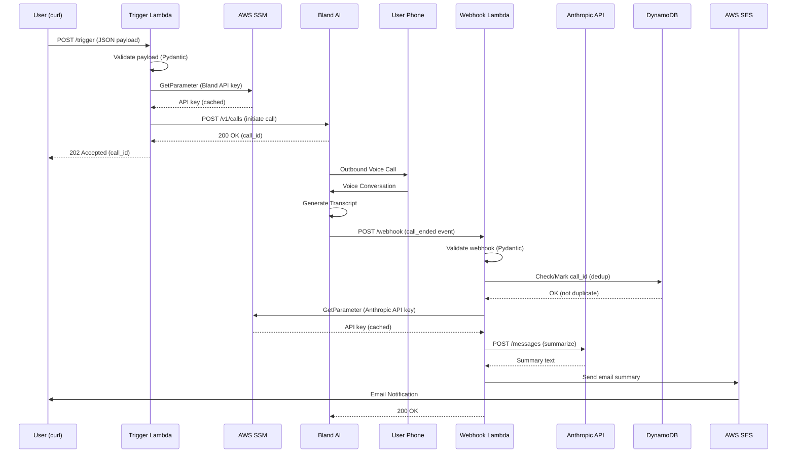

# Kairos Slice 1: Mock Event Debrief

## Architecture Overview



## Stack Decisions

| Component | Choice |
|-----------|--------|
| Voice AI | Bland AI |
| LLM | Anthropic API (Claude Sonnet 4) |
| IaC | AWS CDK (Python) |
| Runtime | Python 3.12 / ARM64 |
| Secrets | AWS SSM Parameter Store (SecureString, fetched at runtime) |
| Notification | AWS SES (email) - SMS planned for later |
| Deduplication | DynamoDB (conditional writes with TTL) |
| Monitoring | CloudWatch Alarms → SNS email alerts |

## Project Structure

```
kairos/
├── cdk/                          # Infrastructure as Code
│   ├── app.py                    # CDK app entry point
│   ├── kairos_stack.py           # Main stack definition
│   └── cdk.json                  # CDK config
├── src/
│   ├── core/                     # Domain logic (pure, no I/O)
│   │   ├── models.py             # Pydantic models
│   │   └── prompts.py            # System prompt templates
│   ├── adapters/                 # External service integrations
│   │   ├── bland.py              # Bland AI client
│   │   ├── anthropic_client.py   # Anthropic API client
│   │   ├── sns.py                # SNS publisher (reserved for SMS)
│   │   ├── ses.py                # SES email publisher
│   │   ├── ssm.py                # SSM Parameter Store (secrets)
│   │   ├── dynamodb.py           # DynamoDB deduplicator
│   │   └── webhook_verify.py     # Bland webhook signature verification
│   └── handlers/                 # Lambda entry points
│       ├── trigger.py            # POST /trigger handler
│       └── webhook.py            # POST /webhook handler
├── tests/
│   └── unit/                     # Unit tests (44 tests)
├── pyproject.toml                # Dependencies
└── Makefile                      # Build commands
```

## API Contracts

### Trigger Payload

```json
{
  "phone_number": "+15551234567",
  "event_context": {
    "event_type": "meeting_debrief",
    "subject": "Q4 Planning Session",
    "participants": ["Sarah Chen", "Mike Ross"],
    "duration_minutes": 45
  },
  "interview_prompts": [
    "What were the key decisions made?",
    "What are the action items and owners?"
  ]
}
```

### Bland AI Webhook Payload

```json
{
  "call_id": "uuid-here",
  "status": "completed",
  "to": "+15551234567",
  "from": "+18005551234",
  "duration": 332,
  "concatenated_transcript": "Assistant: Hi... User: Hey...",
  "variables": {"event_context": "{...}"}
}
```

## Implementation Checklist

### Phase 1: Setup ✅ COMPLETE
- [x] Initialize project structure
- [x] Create pyproject.toml with dependencies
- [x] Implement Pydantic models
- [x] Implement prompt builders
- [x] Create adapters (Bland, Anthropic, SNS, SSM)
- [x] Create Lambda handlers
- [x] Setup CDK stack
- [x] Create unit tests (13 tests passing)
- [x] Store secrets in SSM Parameter Store:
  ```bash
  aws ssm put-parameter --name "/kairos/bland-api-key" --value "sk-..." --type SecureString
  aws ssm put-parameter --name "/kairos/anthropic-api-key" --value "sk-ant-..." --type SecureString
  aws ssm put-parameter --name "/kairos/bland-webhook-secret" --value "whsec_..." --type SecureString
  aws ssm put-parameter --name "/kairos/my-email" --value "you@example.com" --type String
  ```

### Phase 2: Build & Deploy ✅ COMPLETE
- [x] Install dependencies: `uv pip install -e ".[dev,cdk]"`
- [x] Run tests: `make test` (13 passed)
- [x] Run linter: `make lint` (all checks passed)
- [x] Build Lambda layer: `make layer`
- [x] Bootstrap CDK: `cdk bootstrap`
- [x] Deploy: `make deploy`
- [x] Note the Function URLs from CloudFormation outputs

### Phase 3: End-to-End Test ✅ COMPLETE
- [x] Test trigger endpoint
- [x] Answer the phone call
- [x] Complete the debrief conversation
- [x] Verify email summary received (using SES for MVP)

### Phase 4: Hardening ✅ COMPLETE
- [x] Add DynamoDB for call_id deduplication (with TTL auto-cleanup)
- [x] Add CloudWatch Alarms for Lambda errors → SNS email alerts
- [x] Add Bland webhook HMAC-SHA256 signature verification
- [ ] Add SNS SMS as alternative to SES email (pending sandbox exit)

## Deployed Resources

| Resource | Name/ARN |
|----------|----------|
| Trigger Lambda | `kairos-trigger` |
| Webhook Lambda | `kairos-webhook` |
| DynamoDB Table | `kairos-call-dedup` |
| SNS Alarm Topic | `KairosAlarmTopic` |
| Lambda Layer | `KairosDepsLayer` |
| CloudWatch Alarms | `TriggerErrorAlarm`, `WebhookErrorAlarm` |

**Function URLs:** (get from `aws cloudformation describe-stacks --stack-name KairosStack`)
- TriggerUrl: `https://xxx.lambda-url.REGION.on.aws/`
- WebhookUrl: `https://xxx.lambda-url.REGION.on.aws/`

## Secrets Management

API keys are stored as **SecureString** in SSM Parameter Store and fetched at Lambda runtime (not injected as environment variables). This allows:
- Secret rotation without redeployment
- Proper encryption at rest
- IAM-based access control

The SSM adapter (`src/adapters/ssm.py`) uses LRU caching to avoid repeated API calls within a single invocation.

## Cost Estimate (Per Call)

| Service | Cost |
|---------|------|
| Bland AI | ~$0.09/min (est. 3 min = $0.27) |
| Anthropic | ~$0.003 |
| Lambda | < $0.001 |
| DynamoDB | < $0.001 |
| SES Email | < $0.001 |
| SNS SMS | $0.0075 (when enabled) |
| **Total** | **~$0.27 per debrief** |

## Quick Commands

```bash
# Setup
uv venv --python 3.12
source .venv/bin/activate
uv pip install -e ".[dev,cdk]"

# Test & Lint
make test
make lint

# Deploy
make layer
make deploy

# Get Function URLs
aws cloudformation describe-stacks --stack-name KairosStack \
  --query "Stacks[0].Outputs" --output table

# Clean
make clean
```
