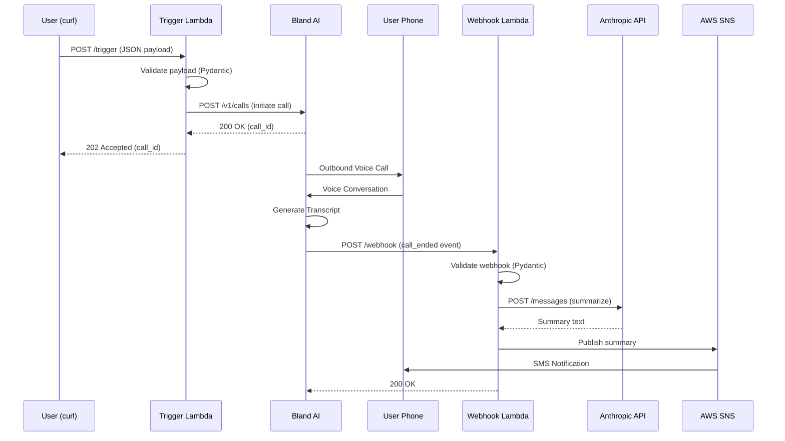

# Kairos Slice 1: Mock Event Debrief

## Architecture Overview



## Stack Decisions

| Component | Choice |
|-----------|--------|
| Voice AI | Bland AI |
| LLM | Anthropic API (Claude Sonnet 4) |
| IaC | AWS CDK (Python) |
| Runtime | Python 3.12 / ARM64 |

## Project Structure

```
kairos/
├── cdk/                          # Infrastructure as Code
│   ├── app.py                    # CDK app entry point
│   ├── kairos_stack.py           # Main stack definition
│   └── cdk.json                  # CDK config
├── src/
│   ├── core/                     # Domain logic (pure, no I/O)
│   │   ├── models.py             # Pydantic models
│   │   └── prompts.py            # System prompt templates
│   ├── adapters/                 # External service integrations
│   │   ├── bland.py              # Bland AI client
│   │   ├── anthropic_client.py   # Anthropic API client
│   │   └── sns.py                # SNS publisher
│   └── handlers/                 # Lambda entry points
│       ├── trigger.py            # POST /trigger handler
│       └── webhook.py            # POST /webhook handler
├── tests/
│   └── unit/                     # Unit tests
├── pyproject.toml                # Dependencies
└── Makefile                      # Build commands
```

## API Contracts

### Trigger Payload

```json
{
  "phone_number": "+15551234567",
  "event_context": {
    "event_type": "meeting_debrief",
    "subject": "Q4 Planning Session",
    "participants": ["Sarah Chen", "Mike Ross"],
    "duration_minutes": 45
  },
  "interview_prompts": [
    "What were the key decisions made?",
    "What are the action items and owners?"
  ]
}
```

### Bland AI Webhook Payload

```json
{
  "call_id": "uuid-here",
  "status": "completed",
  "to": "+15551234567",
  "from": "+18005551234",
  "duration": 332,
  "concatenated_transcript": "Assistant: Hi... User: Hey...",
  "variables": {"event_context": "{...}"}
}
```

## Implementation Checklist

### Phase 1: Setup
- [x] Initialize project structure
- [x] Create pyproject.toml with dependencies
- [x] Implement Pydantic models
- [x] Implement prompt builders
- [x] Create adapter stubs
- [x] Create handler stubs
- [x] Setup CDK skeleton
- [x] Create unit tests
- [ ] Store secrets in SSM Parameter Store:
  ```bash
  aws ssm put-parameter --name "/kairos/bland-api-key" --value "YOUR_KEY" --type SecureString
  aws ssm put-parameter --name "/kairos/anthropic-api-key" --value "YOUR_KEY" --type SecureString
  aws ssm put-parameter --name "/kairos/my-phone-number" --value "+15551234567" --type String
  ```

### Phase 2: Build & Deploy
- [ ] Install dependencies: `make install-dev`
- [ ] Run tests: `make test`
- [ ] Run linter: `make lint`
- [ ] Build Lambda layer: `make layer`
- [ ] Bootstrap CDK (if first time): `cd cdk && cdk bootstrap`
- [ ] Deploy: `make deploy`
- [ ] Note the Function URLs from CloudFormation outputs

### Phase 3: End-to-End Test
- [ ] Test trigger endpoint:
  ```bash
  curl -X POST https://YOUR_TRIGGER_URL/ \
    -H "Content-Type: application/json" \
    -d '{
      "phone_number": "+1YOUR_PHONE",
      "event_context": {
        "event_type": "meeting_debrief",
        "subject": "Test Meeting with Sarah",
        "participants": ["Sarah Chen"]
      },
      "interview_prompts": [
        "What was discussed?",
        "Any follow-ups?"
      ]
    }'
  ```
- [ ] Answer the phone call
- [ ] Complete the debrief conversation
- [ ] Verify SMS summary received

### Phase 4: Hardening (Optional)
- [ ] Add Bland webhook signature validation
- [ ] Add DynamoDB for call_id deduplication
- [ ] Add CloudWatch Alarms for errors
- [ ] Add structured logging correlation IDs

## Cost Estimate (Per Call)

| Service | Cost |
|---------|------|
| Bland AI | ~$0.09/min (est. 3 min = $0.27) |
| Anthropic | ~$0.003 |
| Lambda | < $0.001 |
| SNS SMS | $0.0075 |
| **Total** | **~$0.28 per debrief** |

## Quick Commands

```bash
# Setup
make install-dev

# Test
make test

# Deploy
make deploy

# Clean
make clean
```

