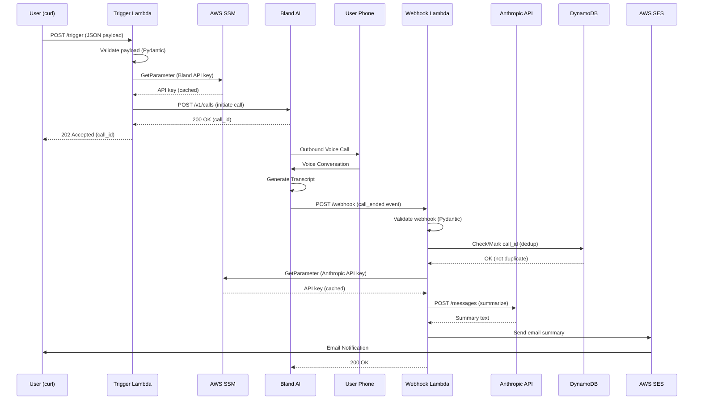

# Kairos Slice 1: Mock Event Debrief

## Architecture Overview



## Stack Decisions

| Component | Choice |
|-----------|--------|
| Voice AI | Bland AI |
| LLM | Anthropic API (Claude Sonnet 4) |
| IaC | AWS CDK (Python) |
| Runtime | Python 3.12 / ARM64 |
| Secrets | AWS SSM Parameter Store (SecureString, fetched at runtime) |
| Notification | AWS SES (email) - SMS planned for later |
| Deduplication | DynamoDB (conditional writes with TTL) |
| Monitoring | CloudWatch Alarms → SNS email alerts |

## Project Structure

```
kairos/
├── cdk/                          # Infrastructure as Code
│   ├── app.py                    # CDK app entry point
│   ├── kairos_stack.py           # Main stack definition
│   └── cdk.json                  # CDK config
├── src/
│   ├── core/                     # Domain logic (pure, no I/O)
│   │   ├── models.py             # Pydantic models
│   │   └── prompts.py            # System prompt templates
│   ├── adapters/                 # External service integrations
│   │   ├── bland.py              # Bland AI client
│   │   ├── anthropic_client.py   # Anthropic API client
│   │   ├── sns.py                # SNS publisher (reserved for SMS)
│   │   ├── ses.py                # SES email publisher
│   │   ├── ssm.py                # SSM Parameter Store (secrets)
│   │   └── dynamodb.py           # DynamoDB deduplicator
│   └── handlers/                 # Lambda entry points
│       ├── trigger.py            # POST /trigger handler
│       └── webhook.py            # POST /webhook handler
├── tests/
│   └── unit/                     # Unit tests (36 tests)
├── pyproject.toml                # Dependencies
└── Makefile                      # Build commands
```

## API Contracts

### Trigger Payload

```json
{
  "phone_number": "+15551234567",
  "event_context": {
    "event_type": "meeting_debrief",
    "subject": "Q4 Planning Session",
    "participants": ["Sarah Chen", "Mike Ross"],
    "duration_minutes": 45
  },
  "interview_prompts": [
    "What were the key decisions made?",
    "What are the action items and owners?"
  ]
}
```

### Bland AI Webhook Payload

```json
{
  "call_id": "uuid-here",
  "status": "completed",
  "to": "+15551234567",
  "from": "+18005551234",
  "duration": 332,
  "concatenated_transcript": "Assistant: Hi... User: Hey...",
  "variables": {"event_context": "{...}"}
}
```

## Implementation Checklist

### Phase 1: Setup ✅ COMPLETE
- [x] Initialize project structure
- [x] Create pyproject.toml with dependencies
- [x] Implement Pydantic models
- [x] Implement prompt builders
- [x] Create adapters (Bland, Anthropic, SNS, SSM)
- [x] Create Lambda handlers
- [x] Setup CDK stack
- [x] Create unit tests (13 tests passing)
- [x] Store secrets in SSM Parameter Store:
  ```bash
  aws ssm put-parameter --name "/kairos/bland-api-key" --value "sk-..." --type SecureString
  aws ssm put-parameter --name "/kairos/anthropic-api-key" --value "sk-ant-..." --type SecureString
  aws ssm put-parameter --name "/kairos/bland-webhook-secret" --value "whsec_..." --type SecureString
  aws ssm put-parameter --name "/kairos/my-email" --value "you@example.com" --type String
  ```

### Phase 2: Build & Deploy ✅ COMPLETE
- [x] Install dependencies: `uv pip install -e ".[dev,cdk]"`
- [x] Run tests: `make test` (13 passed)
- [x] Run linter: `make lint` (all checks passed)
- [x] Build Lambda layer: `make layer`
- [x] Bootstrap CDK: `cdk bootstrap`
- [x] Deploy: `make deploy`
- [x] Note the Function URLs from CloudFormation outputs

### Phase 3: End-to-End Test ✅ COMPLETE
- [x] Test trigger endpoint
- [x] Answer the phone call
- [x] Complete the debrief conversation
- [x] Verify email summary received (using SES for MVP)

### Phase 4: Hardening ✅ COMPLETE
- [x] Add DynamoDB for call_id deduplication (with TTL auto-cleanup)
- [x] Add CloudWatch Alarms for Lambda errors → SNS email alerts
- [x] Add Bland webhook HMAC-SHA256 signature verification
- [ ] Add SNS SMS as alternative to SES email (pending sandbox exit)

## Deployed Resources

| Resource | Name/ARN |
|----------|----------|
| Trigger Lambda | `kairos-trigger` |
| Webhook Lambda | `kairos-webhook` |
| DynamoDB Table | `kairos-call-dedup` |
| SNS Alarm Topic | `KairosAlarmTopic` |
| Lambda Layer | `KairosDepsLayer` |
| CloudWatch Alarms | `TriggerErrorAlarm`, `WebhookErrorAlarm` |

**Function URLs:** (get from `aws cloudformation describe-stacks --stack-name KairosStack`)
- TriggerUrl: `https://xxx.lambda-url.REGION.on.aws/`
- WebhookUrl: `https://xxx.lambda-url.REGION.on.aws/`

## Secrets Management

API keys are stored as **SecureString** in SSM Parameter Store and fetched at Lambda runtime (not injected as environment variables). This allows:
- Secret rotation without redeployment
- Proper encryption at rest
- IAM-based access control

The SSM adapter (`src/adapters/ssm.py`) uses LRU caching to avoid repeated API calls within a single invocation.

## Cost Estimate (Per Call)

| Service | Cost |
|---------|------|
| Bland AI | ~$0.09/min (est. 3 min = $0.27) |
| Anthropic | ~$0.003 |
| Lambda | < $0.001 |
| DynamoDB | < $0.001 |
| SES Email | < $0.001 |
| SNS SMS | $0.0075 (when enabled) |
| **Total** | **~$0.27 per debrief** |

## Quick Commands

```bash
# Setup
uv venv --python 3.12
source .venv/bin/activate
uv pip install -e ".[dev,cdk]"

# Test & Lint
make test
make lint

# Deploy
make layer
make deploy

# Get Function URLs
aws cloudformation describe-stacks --stack-name KairosStack \
  --query "Stacks[0].Outputs" --output table

# Clean
make clean
```

---

# Slice 2: Smart Calendar-Driven Debriefs

## Overview

Automatically trigger debrief calls based on Google Calendar events, with intelligent batching and user-controlled timing.

### User Experience Flow

```
[Back-to-back meetings end]
    → [Gap detected - 15+ min free]
    → SMS: "You had 3 meetings (Q4 Planning, 1:1 Sarah, Standup). Debrief call?"
    → User replies: "yes" → Call initiates
    → User replies: "no"  → "OK, ping me when ready"
    → [User texts "ready" later] → Call initiates
    → AI reviews each meeting sequentially
    → Summary email sent
```

### Key Design Decisions

| Decision | Choice | Rationale |
|----------|--------|-----------|
| Calendar sync | **Google Push (Webhooks)** | Scalable for multi-user, real-time |
| Orchestration | **Step Functions** | State machine, callbacks, timeouts built-in |
| 2-way SMS | **Twilio** | SNS can't receive replies |
| Meeting state | **DynamoDB** | Fast queries, SF reads fresh state each loop |
| Execution model | **One SF per user per day** | Avoids duplicate prompts, clean lifecycle |

## Architecture

```
┌─────────────────────────────────────────────────────────────────────────────┐
│                              SLICE 2 ARCHITECTURE                           │
├─────────────────────────────────────────────────────────────────────────────┤
│                                                                             │
│  ┌──────────────┐      ┌─────────────────┐      ┌─────────────────┐         │
│  │   Google     │─────►│ Calendar Webhook│─────►│   DynamoDB      │         │
│  │  Calendar    │ push │    Lambda       │      │  (meetings)     │         │
│  └──────────────┘      └─────────────────┘      └────────┬────────┘         │
│                                                          │                  │
│                                                          │ queries          │
│  ┌──────────────┐      ┌─────────────────────────────────▼────────────────┐ │
│  │ EventBridge  │─────►│            Step Function                         │ │
│  │ (8am daily)  │start │         (Daily Debrief Orchestrator)             │ │
│  └──────────────┘      │                                                  │ │
│                        │  ┌─────────┐    ┌─────────┐    ┌──────────────┐  │ │
│                        │  │ Check   │───►│ Wait &  │───►│ Prompt User  │  │ │
│                        │  │Meetings │    │ Detect  │    │ (SMS)        │  │ │
│                        │  └─────────┘    │ Gap     │    └──────┬───────┘  │ │
│                        │                 └─────────┘           │          │ │
│                        │                      ▲                │          │ │
│                        │                      │                ▼          │ │
│                        │                      │         ┌──────────────┐  │ │
│                        │                      └─────────│Handle Reply  │  │ │
│                        │                                │(yes/no/wait) │  │ │
│                        │                                └──────┬───────┘  │ │
│                        │                                       │          │ │
│                        │                                       ▼          │ │
│                        │                                ┌──────────────┐  │ │
│                        │                                │Initiate Call │  │ │
│                        │                                └──────────────┘  │ │
│                        └──────────────────────────────────────────────────┘ │
│                                          │                                  │
│                        ┌─────────────────┼─────────────────┐                │
│                        ▼                 ▼                 ▼                │
│                 ┌────────────┐    ┌────────────┐    ┌────────────┐          │
│                 │   Twilio   │    │  Bland AI  │    │    SES     │          │
│                 │ (2-way SMS)│    │  (calls)   │    │  (email)   │          │
│                 └────────────┘    └────────────┘    └────────────┘          │
│                                                                             │
└─────────────────────────────────────────────────────────────────────────────┘
```

## Step Function: Daily Debrief Orchestrator

```
┌─────────────────────────────────────────────────────────────────────────┐
│              Daily Debrief Orchestrator (per user, per day)             │
├─────────────────────────────────────────────────────────────────────────┤
│                                                                         │
│  START (triggered by EventBridge at 8am)                                │
│    │                                                                    │
│    ▼                                                                    │
│  ┌──────────────────┐                                                   │
│  │ CheckHasMeetings │ ── [No meetings today] ──► END                    │
│  └────────┬─────────┘                                                   │
│           │ [Has meetings]                                              │
│           ▼                                                             │
│  ┌────────────────────────────────────────────────────────────────┐     │
│  │                        DAILY LOOP                              │     │
│  │                                                                │     │
│  │  ┌─────────────┐                                               │     │
│  │  │ WaitForGap  │◄──────────────────────────────────────────┐   │     │
│  │  │ (poll 5min) │                                           │   │     │
│  │  └──────┬──────┘                                           │   │     │
│  │         │                                                  │   │     │
│  │    ┌────┴─────┬──────────────┐                             │   │     │
│  │    ▼          ▼              ▼                             │   │     │
│  │ [Gap +     [In mtg/      [Past EOD]                        │   │     │
│  │  pending]   no pending]      │                             │   │     │
│  │    │          │              ▼                             │   │     │
│  │    │          └──────► [continue loop]              FinalCheck ──► END
│  │    ▼                                                       │   │     │
│  │ ┌────────────────┐                                         │   │     │
│  │ │ SendPromptSMS  │  "3 meetings to debrief. Call now?"     │   │     │
│  │ └───────┬────────┘                                         │   │     │
│  │         │                                                  │   │     │
│  │         ▼                                                  │   │     │
│  │ ┌───────────────────────────────┐                          │   │     │
│  │ │ WaitForReply                  │                          │   │     │
│  │ │ (Task Token + 4hr timeout)    │                          │   │     │
│  │ └───────┬───────────────┬───────┘                          │   │     │
│  │         │               │                                  │   │     │
│  │    [SMS Reply]     [Timeout]                               │   │     │
│  │         │               │                                  │   │     │
│  │         ▼               ▼                                  │   │     │
│  │ ┌─────────────┐  ┌─────────────┐                           │   │     │
│  │ │ChoiceState  │  │SendReminder │ "Still have meetings..."  │   │     │
│  │ └──┬───┬───┬──┘  └──────┬──────┘                           │   │     │
│  │    │   │   │            │                                  │   │     │
│  │ "yes" "no" other        └──► [WaitForReply again]          │   │     │
│  │    │   │   │                                               │   │     │
│  │    │   │   └──► [Re-prompt: "Reply yes or no"]             │   │     │
│  │    │   │                                                   │   │     │
│  │    │   ▼                                                   │   │     │
│  │    │ ┌────────────────────────────────┐                    │   │     │
│  │    │ │ SendWaitingSMS                 │                    │   │     │
│  │    │ │ "OK, ping me when ready"       │                    │   │     │
│  │    │ └───────────┬────────────────────┘                    │   │     │
│  │    │             │                                         │   │     │
│  │    │             ▼                                         │   │     │
│  │    │ ┌────────────────────────────────┐                    │   │     │
│  │    │ │ WaitForUserPing                │                    │   │     │
│  │    │ │ (until EOD or user texts)      │                    │   │     │
│  │    │ └───────┬────────────────┬───────┘                    │   │     │
│  │    │         │                │                            │   │     │
│  │    │    [User pings]     [EOD timeout]                     │   │     │
│  │    │         │                │                            │   │     │
│  │    │         │                └──► FinalReminder ──────────┤   │     │
│  │    │         │                                             │   │     │
│  │    ▼         ▼                                             │   │     │
│  │ ┌──────────────────┐                                       │   │     │
│  │ │ CheckStillValid  │ ── [0 pending] ── SMS "All clear!" ───┘   │     │
│  │ └────────┬─────────┘                                       │   │     │
│  │          │ [>0 pending]                                    │   │     │
│  │          ▼                                                 │   │     │
│  │ ┌──────────────────┐                                       │   │     │
│  │ │ InitiateBlandCall│ (multi-meeting context)               │   │     │
│  │ └────────┬─────────┘                                       │   │     │
│  │          │                                                 │   │     │
│  │          ▼                                                 │   │     │
│  │ ┌──────────────────┐                                       │   │     │
│  │ │ MarkDebriefed    │ (update DynamoDB)                     │   │     │
│  │ └────────┬─────────┘                                       │   │     │
│  │          │                                                 │   │     │
│  │          └─────────────────────────────────────────────────┘   │     │
│  │                                                                │     │
│  └────────────────────────────────────────────────────────────────┘     │
│                                                                         │
└─────────────────────────────────────────────────────────────────────────┘
```

## Data Model

### DynamoDB: `kairos-meetings` Table

| Attribute | Type | Description |
|-----------|------|-------------|
| `user_id` | PK | User identifier |
| `meeting_id` | SK | Google Calendar event ID |
| `title` | String | Meeting subject |
| `start_time` | ISO8601 | Meeting start |
| `end_time` | ISO8601 | Meeting end |
| `attendees` | List | Participant names |
| `status` | String | `pending` / `debriefed` / `skipped` |
| `google_etag` | String | For sync conflict detection |
| `created_at` | ISO8601 | When synced |
| `ttl` | Number | Auto-cleanup after 30 days |

### DynamoDB: `kairos-user-state` Table

| Attribute | Type | Description |
|-----------|------|-------------|
| `user_id` | PK | User identifier |
| `google_refresh_token` | String (encrypted) | OAuth refresh token |
| `google_channel_id` | String | Calendar push subscription ID |
| `google_channel_expiry` | ISO8601 | When to renew subscription |
| `phone_number` | String | For SMS (E.164) |
| `email` | String | For summaries |
| `timezone` | String | e.g., "Europe/London" |
| `settings` | Map | Preferences (gap threshold, EOD hour, etc.) |

## New Project Structure (Additions)

```
kairos/
├── src/
│   ├── adapters/
│   │   ├── ... (existing)
│   │   ├── google_calendar.py    # OAuth + Calendar API
│   │   ├── twilio_sms.py         # Send/receive SMS
│   │   └── step_functions.py     # SF task token callbacks
│   ├── handlers/
│   │   ├── ... (existing)
│   │   ├── calendar_webhook.py   # Google push notifications
│   │   ├── sms_webhook.py        # Twilio inbound SMS
│   │   ├── gap_detector.py       # SF task: check for gaps
│   │   ├── send_prompt.py        # SF task: send SMS prompt
│   │   └── initiate_call.py      # SF task: start Bland call
│   └── state_machine/
│       └── daily_orchestrator.asl.json  # Step Function definition
├── cdk/
│   ├── kairos_stack.py           # Slice 1 resources
│   └── kairos_slice2_stack.py    # Slice 2 resources (or extend existing)
```

## Implementation Phases

### Phase 2A: Google Calendar Integration
- [ ] Create Google Cloud project & OAuth credentials
- [ ] Implement `google_calendar.py` adapter (OAuth2 + Calendar API)
- [ ] Create `calendar_webhook.py` Lambda handler
- [ ] Create `kairos-meetings` DynamoDB table
- [ ] Sync calendar events → DynamoDB on webhook
- [ ] Handle webhook verification (Google challenge)
- [ ] Setup calendar push subscription (watch)
- [ ] Store refresh token in SSM (encrypted)
- [ ] Add CDK resources (Lambda, DynamoDB, Function URL)
- [ ] Manual test: Add/edit/delete calendar events, verify DynamoDB sync

### Phase 2B: Step Function Orchestrator
- [ ] Define Step Function ASL (daily_orchestrator.asl.json)
- [ ] Create EventBridge rule (8am weekdays, user timezone)
- [ ] Implement `gap_detector.py` (query DynamoDB for gaps)
- [ ] Add SF execution singleton logic (user_id + date)
- [ ] Create `kairos-user-state` DynamoDB table
- [ ] Add CDK resources (Step Function, EventBridge, IAM roles)
- [ ] Manual test: Trigger SF, verify loop runs and detects gaps

### Phase 2C: Twilio 2-Way SMS
- [ ] Create Twilio account & phone number
- [ ] Implement `twilio_sms.py` adapter (send + receive)
- [ ] Create `sms_webhook.py` Lambda (Twilio inbound)
- [ ] Implement SF task token callback flow
- [ ] Store Twilio credentials in SSM
- [ ] Add `send_prompt.py` SF task Lambda
- [ ] Add CDK resources (Lambda, Function URL for Twilio webhook)
- [ ] Manual test: SF sends SMS, user replies, SF resumes

### Phase 2D: Multi-Meeting Debrief Calls
- [ ] Update prompts for sequential meeting review
- [ ] Create `initiate_call.py` SF task Lambda
- [ ] Pass multiple meetings context to Bland
- [ ] Update `webhook.py` to mark meetings as debriefed
- [ ] Handle call completion → update DynamoDB status
- [ ] Manual test: Full flow with 3+ meetings batched

### Phase 2E: Edge Cases & Polish
- [ ] Handle "no" → waiting state → user pings later
- [ ] Pre-call validation (meetings still pending?)
- [ ] EOD final reminder
- [ ] Calendar subscription renewal (before expiry)
- [ ] Handle calendar sync conflicts (etag)
- [ ] Add CloudWatch alarms for SF failures
- [ ] Add structured logging / X-Ray tracing

## Configuration (SSM Parameters)

```bash
# Google OAuth (from Google Cloud Console)
aws ssm put-parameter --name "/kairos/google-client-id" --value "xxx.apps.googleusercontent.com" --type String
aws ssm put-parameter --name "/kairos/google-client-secret" --value "GOCSPX-xxx" --type SecureString
aws ssm put-parameter --name "/kairos/google-refresh-token" --value "1//xxx" --type SecureString

# Twilio
aws ssm put-parameter --name "/kairos/twilio-account-sid" --value "ACxxx" --type String
aws ssm put-parameter --name "/kairos/twilio-auth-token" --value "xxx" --type SecureString
aws ssm put-parameter --name "/kairos/twilio-phone-number" --value "+1xxx" --type String

# User settings (MVP: single user)
aws ssm put-parameter --name "/kairos/user-phone-number" --value "+44xxx" --type String
aws ssm put-parameter --name "/kairos/user-timezone" --value "Europe/London" --type String
```

## Cost Estimate (Per Day, ~10 meetings)

| Service | Cost |
|---------|------|
| Google Calendar API | Free (within quota) |
| Step Functions | ~$0.025 (Standard, ~1000 state transitions) |
| Twilio SMS (send) | ~$0.05 (2-3 messages) |
| Twilio SMS (receive) | ~$0.01 |
| Twilio Phone Number | ~$1/month |
| DynamoDB | < $0.01 |
| Lambda | < $0.01 |
| Bland AI (1 call, 5 min) | ~$0.45 |
| **Total** | **~$0.55/day + $1/month Twilio** |
