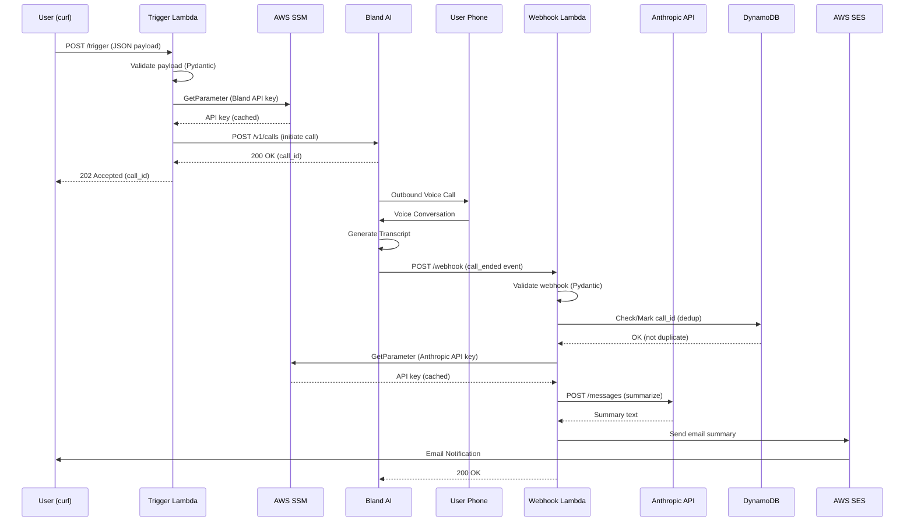

Updated `PLAN.md` (Slice 1 preserved from your current file; Slice 2 rewritten to match the fixed-time, ask-first SMS MVP with scheduler reconciliation + idempotency/fencing, and Europe/London timezone). Slice 1 content is taken from your uploaded plan .

```markdown
# Kairos Slice 1: Mock Event Debrief

## Architecture Overview



## Stack Decisions

| Component | Choice |
|-----------|--------|
| Voice AI | Bland AI |
| LLM | Anthropic API (Claude Sonnet 4) |
| IaC | AWS CDK (Python) |
| Runtime | Python 3.12 / ARM64 |
| Secrets | AWS SSM Parameter Store (SecureString, fetched at runtime) |
| Notification | AWS SES (email) - SMS planned for later |
| Deduplication | DynamoDB (conditional writes with TTL) |
| Monitoring | CloudWatch Alarms → SNS email alerts |

## Project Structure

```
kairos/
├── cdk/                          # Infrastructure as Code
│   ├── app.py                    # CDK app entry point
│   ├── kairos_stack.py           # Main stack definition
│   └── cdk.json                  # CDK config
├── src/
│   ├── core/                     # Domain logic (pure, no I/O)
│   │   ├── models.py             # Pydantic models
│   │   └── prompts.py            # System prompt templates
│   ├── adapters/                 # External service integrations
│   │   ├── bland.py              # Bland AI client
│   │   ├── anthropic_client.py   # Anthropic API client
│   │   ├── sns.py                # SNS publisher (reserved for SMS)
│   │   ├── ses.py                # SES email publisher
│   │   ├── ssm.py                # SSM Parameter Store (secrets)
│   │   └── dynamodb.py           # DynamoDB deduplicator
│   └── handlers/                 # Lambda entry points
│       ├── trigger.py            # POST /trigger handler
│       └── webhook.py            # POST /webhook handler
├── tests/
│   └── unit/                     # Unit tests (36 tests)
├── pyproject.toml                # Dependencies
└── Makefile                      # Build commands
```

## API Contracts

### Trigger Payload

```json
{
  "phone_number": "+15551234567",
  "event_context": {
    "event_type": "meeting_debrief",
    "subject": "Q4 Planning Session",
    "participants": ["Sarah Chen", "Mike Ross"],
    "duration_minutes": 45
  },
  "interview_prompts": [
    "What were the key decisions made?",
    "What are the action items and owners?"
  ]
}
```

### Bland AI Webhook Payload

```json
{
  "call_id": "uuid-here",
  "status": "completed",
  "to": "+15551234567",
  "from": "+18005551234",
  "duration": 332,
  "concatenated_transcript": "Assistant: Hi... User: Hey...",
  "variables": {"event_context": "{...}"}
}
```

## Implementation Checklist

### Phase 1: Setup ✅ COMPLETE
- [x] Initialize project structure
- [x] Create pyproject.toml with dependencies
- [x] Implement Pydantic models
- [x] Implement prompt builders
- [x] Create adapters (Bland, Anthropic, SNS, SSM)
- [x] Create Lambda handlers
- [x] Setup CDK stack
- [x] Create unit tests (13 tests passing)
- [x] Store secrets in SSM Parameter Store:
  ```bash
  aws ssm put-parameter --name "/kairos/bland-api-key" --value "sk-..." --type SecureString
  aws ssm put-parameter --name "/kairos/anthropic-api-key" --value "sk-ant-..." --type SecureString
  aws ssm put-parameter --name "/kairos/bland-webhook-secret" --value "whsec_..." --type SecureString
  aws ssm put-parameter --name "/kairos/my-email" --value "you@example.com" --type String
  ```

### Phase 2: Build & Deploy ✅ COMPLETE
- [x] Install dependencies: `uv pip install -e ".[dev,cdk]"`
- [x] Run tests: `make test` (13 passed)
- [x] Run linter: `make lint` (all checks passed)
- [x] Build Lambda layer: `make layer`
- [x] Bootstrap CDK: `cdk bootstrap`
- [x] Deploy: `make deploy`
- [x] Note the Function URLs from CloudFormation outputs

### Phase 3: End-to-End Test ✅ COMPLETE
- [x] Test trigger endpoint
- [x] Answer the phone call
- [x] Complete the debrief conversation
- [x] Verify email summary received (using SES for MVP)

### Phase 4: Hardening ✅ COMPLETE
- [x] Add DynamoDB for call_id deduplication (with TTL auto-cleanup)
- [x] Add CloudWatch Alarms for Lambda errors → SNS email alerts
- [x] Add Bland webhook HMAC-SHA256 signature verification
- [ ] Add SNS SMS as alternative to SES email (pending sandbox exit)

## Deployed Resources

| Resource | Name/ARN |
|----------|----------|
| Trigger Lambda | `kairos-trigger` |
| Webhook Lambda | `kairos-webhook` |
| DynamoDB Table | `kairos-call-dedup` |
| SNS Alarm Topic | `KairosAlarmTopic` |
| Lambda Layer | `KairosDepsLayer` |
| CloudWatch Alarms | `TriggerErrorAlarm`, `WebhookErrorAlarm` |

**Function URLs:** (get from `aws cloudformation describe-stacks --stack-name KairosStack`)
- TriggerUrl: `https://xxx.lambda-url.REGION.on.aws/`
- WebhookUrl: `https://xxx.lambda-url.REGION.on.aws/`

## Secrets Management

API keys are stored as **SecureString** in SSM Parameter Store and fetched at Lambda runtime (not injected as environment variables). This allows:
- Secret rotation without redeployment
- Proper encryption at rest
- IAM-based access control

The SSM adapter (`src/adapters/ssm.py`) uses LRU caching to avoid repeated API calls within a single invocation.

## Cost Estimate (Per Call)

| Service | Cost |
|---------|------|
| Bland AI | ~$0.09/min (est. 3 min = $0.27) |
| Anthropic | ~$0.003 |
| Lambda | < $0.001 |
| DynamoDB | < $0.001 |
| SES Email | < $0.001 |
| SNS SMS | $0.0075 (when enabled) |
| **Total** | **~$0.27 per debrief** |

## Quick Commands

```bash
# Setup
uv venv --python 3.12
source .venv/bin/activate
uv pip install -e ".[dev,cdk]"

# Test & Lint
make test
make lint

# Deploy
make layer
make deploy

# Get Function URLs
aws cloudformation describe-stacks --stack-name KairosStack \
  --query "Stacks[0].Outputs" --output table

# Clean
make clean
```

---

# Slice 2: Fixed-Time SMS Prompt Debriefs (MVP, Single User)

## Overview

A predictable, low-annoyance approach to calendar-driven debriefs. We intentionally avoid Step Functions and gap-detection polling. The system prompts **once per day at a fixed time** (user-configurable later), waits for an SMS reply (event-driven), and initiates **at most one debrief call per day**.

### MVP Policy (Single User)

- **One debrief call per day maximum**
- **Ask-first via SMS** at a fixed scheduled time (configurable), NOT gap detection
- **No reminders/nagging by default**: if the user ignores the prompt, do nothing until tomorrow
- **If the user replies NO**: snooze until tomorrow (but they can text READY later)
- **Inbound SMS can arrive anytime** (minutes/hours later) and must still work
- **Timezone for MVP**: `Europe/London` (DST-aware)

---

## User Experience Flow (Canonical)

```
[08:00 Europe/London] Daily planner runs
  → Ensures today's "📞 Kairos Debrief" event exists in Google Calendar at preferred time (default 17:30)
  → Resets daily counters
  → Schedules a one-time prompt trigger at the event time (EventBridge Scheduler)

[User sees the event]
  → Can move it to change the prompt time
  → Can delete it to skip today
  → Calendar webhook detects move/delete and reconciles the one-time schedule

[Prompt time] Prompt Sender runs
  → Double-checks the debrief event (belt & suspenders)
  → If unchanged + pending meetings exist: sends exactly one SMS prompt

[User replies anytime]
  YES/READY → initiate the daily debrief call immediately (idempotent)
  NO        → snooze until tomorrow (no reminders)
  STOP      → opt out of all future prompts

[Call completes]
  → Existing Bland webhook pipeline summarizes
  → Meetings marked debriefed
  → Summary sent via SMS (Twilio) (optionally also email later)
  → Debrief calendar event deleted or marked completed
```

---

## Key Design Decisions

| Decision | Choice | Rationale |
|----------|--------|-----------|
| Calendar sync | Google Push (Webhooks) | Real-time meeting updates |
| Debrief scheduling UX | A calendar event the user can move/delete | Founders already “live” in calendar; predictable |
| Orchestration | EventBridge Scheduler (recurring + one-time) | Exact timing, no polling loops |
| SMS | Twilio | 2-way SMS (inbound replies) |
| State | DynamoDB | Durable state + idempotency |
| Idempotency | Conditional writes | Prevent duplicate prompts/calls under retries |

---

## Architecture (MVP, no Step Functions)

```mermaid
flowchart LR
  GC[Google Calendar] -->|push watch| CALWH[calendar_webhook Lambda]
  CALWH --> MEET[(DynamoDB kairos-meetings)]
  CALWH --> USTATE[(DynamoDB kairos-user-state)]
  CALWH -->|move/delete debrief event| SCHED[EventBridge Scheduler]

  PLANSCHED[Scheduler: daily 08:00 Europe/London] --> PLAN[daily_plan_prompt Lambda]
  PLAN --> GC
  PLAN --> USTATE
  PLAN -->|reconcile| SCHED

  SCHED -->|one-time at prompt time| PROMPT[prompt_sender Lambda]
  PROMPT --> GC
  PROMPT --> MEET
  PROMPT --> USTATE
  PROMPT --> TWOUT[Twilio outbound SMS]

  TWIN[Twilio inbound SMS] --> SMSWH[sms_webhook Lambda]
  SMSWH --> USTATE
  SMSWH -->|YES/READY| CALL[initiate_daily_call Lambda]
  CALL --> MEET
  CALL --> BLAND[Bland AI call]

  BLAND -->|call_ended webhook| WEBHOOK[webhook Lambda (existing)]
  WEBHOOK --> MEET
  WEBHOOK --> USTATE
  WEBHOOK --> TWOUT
```

---

## Scheduling (Europe/London, DST-safe)

### Recurring schedule
Use **EventBridge Scheduler** for a recurring trigger:
- `daily_plan_prompt` runs at **08:00 Europe/London** (not UTC).

### One-time prompt schedule
For each day, create exactly one schedule that fires at `next_prompt_at`:
- schedule name is deterministic: `kairos-prompt-{user_id}-{YYYY-MM-DD}`.
- created/updated by `daily_plan_prompt` and by `calendar_webhook` (if user moves the event).

---

## Budget & Safety Rules (hard rules)

These rules are enforced before sending SMS or initiating calls:

1. If `stopped == true` → **never prompt/call**
2. If `prompts_sent_today >= 1` → **never prompt again today**
3. If `daily_call_made == true` → **never call again today**
4. If `snooze_until > now` → **do not prompt/call**
5. **No reminders by default** (single prompt/day, no follow-ups)

---

## Idempotency / Dedup / Fencing

Retries can happen from Scheduler, Twilio, Google webhooks, and Lambda itself. Treat every side-effect as idempotent.

### DynamoDB: `kairos-idempotency`
Single table with PK `idempotency_key` and TTL.

**Key formats (canonical)**
- Outbound prompt SMS: `sms-send:{user_id}#{YYYY-MM-DD}`
- Inbound SMS: `sms-in:{TwilioMessageSid}`
- Daily call: `call-batch:{user_id}#{YYYY-MM-DD}`
- Daily planner lease: `daily-plan:{user_id}#{YYYY-MM-DD}`
- (Optional) Schedule reconciliation fence: `schedule:{user_id}#{YYYY-MM-DD}`

**Conditional write rules**
- Prompt sender must acquire `sms-send:*` **before** sending any SMS.
- SMS webhook must acquire `sms-in:*` **before** parsing/acting.
- Call initiator must acquire `call-batch:*` **before** creating a Bland call.
- Daily planner must acquire `daily-plan:*` to avoid duplicate runs.

### Existing webhook dedup
Keep the existing Bland webhook `call_id` dedup table/pattern from Slice 1.

---

## Schedule Reconciliation (canonical spec)

We must ensure: **moving/deleting the debrief event never causes extra prompts** and never leaves orphan schedules behind.

### Deterministic schedule naming
- `prompt_schedule_name = kairos-prompt-{user_id}-{YYYY-MM-DD}`

### Reconciliation function (shared)
Implemented in a shared module (e.g., `src/adapters/scheduler.py`) and used by:
- `daily_plan_prompt`
- `calendar_webhook`
- (optionally) `prompt_sender` for belt-and-suspenders

**Inputs**
- `schedule_name`
- `target_time_utc_iso` (derived from Europe/London local time)
- `target_lambda_arn`
- `payload` (e.g., `{user_id, date}`)

**Algorithm**
1. (Optional) acquire `schedule:{user_id}#{YYYY-MM-DD}` idempotency key; if already acquired, no-op.
2. If `target_time` is in the past: best-effort delete schedule; clear `next_prompt_at`; exit.
3. Attempt `UpdateSchedule(schedule_name, at(target_time_utc_iso), target=...)`.
4. If schedule does not exist: `CreateSchedule` with that name.
5. Ensure schedule auto-deletes after execution if supported/desired.

### Calendar move/delete behavior
- If user **moves** event: recompute `next_prompt_at`, update `kairos-user-state`, then reconcile schedule to the new time.
- If user **deletes** event: clear `next_prompt_at` and debrief event IDs; delete schedule; do not prompt today.

---

## Calendar Debrief Event (robust identification)

Keep storing `debrief_event_id` and `debrief_event_etag`, but also tag the event so it can be rediscovered reliably:

- `extendedProperties.private.kairos_type = "debrief"`
- `extendedProperties.private.kairos_user_id = "{user_id}"`
- `extendedProperties.private.kairos_date = "YYYY-MM-DD"`

**Event defaults**
- Title: `📞 Kairos Debrief`
- Duration: 15 minutes
- Description: short instructions (how to reply; that moving changes prompt time)
- User can move or delete.

Post-call, choose one:
- **Option A (recommended):** delete the event (clean calendar)
- **Option B:** update title to `✅ Kairos Debrief (completed)`

---

## Data Model

### DynamoDB: `kairos-meetings` (existing)

| Attribute | Type | Description |
|-----------|------|-------------|
| `user_id` | PK | User identifier |
| `meeting_id` | SK | Google Calendar event ID |
| `title` | String | Meeting subject |
| `start_time` | ISO8601 | Meeting start |
| `end_time` | ISO8601 | Meeting end |
| `attendees` | List | Participant names |
| `status` | String | `pending` / `debriefed` / `skipped` |
| `google_etag` | String | For sync conflict detection |
| `created_at` | ISO8601 | When synced |
| `ttl` | Number | Auto-cleanup after 30 days |

**GSI (recommended, low-effort, future-proof)**
- `GSI1PK = user_id`
- `GSI1SK = start_time` (or `start_time#meeting_id`)

### DynamoDB: `kairos-user-state`

For MVP single-user, store the **Google refresh token in SSM**, not DynamoDB (avoid duplicating sources of truth).

| Attribute | Type | Description |
|-----------|------|-------------|
| `user_id` | PK | User identifier |
| `phone_number` | String | E.164 |
| `email` | String | Optional (future) |
| `timezone` | String | `"Europe/London"` |
| `preferred_prompt_time` | String | `"17:30"` (HH:MM) |
| `next_prompt_at` | ISO8601 | Next prompt timestamp (UTC or ISO with Z) |
| `prompt_schedule_name` | String | `kairos-prompt-{user_id}-{YYYY-MM-DD}` |
| `debrief_event_id` | String | Google event ID |
| `debrief_event_etag` | String | Google etag |
| `prompts_sent_today` | Number | Max 1 |
| `last_prompt_at` | ISO8601 | Last prompt sent |
| `awaiting_reply` | Boolean | True after prompt |
| `active_prompt_id` | String | e.g., `user_id#YYYY-MM-DD` |
| `daily_call_made` | Boolean | True after initiating call |
| `last_call_at` | ISO8601 | When call initiated |
| `daily_batch_id` | String | `user_id#YYYY-MM-DD` |
| `last_daily_reset` | ISO8601 | Daily reset timestamp |
| `snooze_until` | ISO8601 | Snooze |
| `stopped` | Boolean | STOP opt-out |
| `google_channel_id` | String | Push subscription ID |
| `google_channel_expiry` | ISO8601 | Renewal time |

### DynamoDB: `kairos-idempotency`

| Attribute | Type | Description |
|-----------|------|-------------|
| `idempotency_key` | PK | Unique operation key |
| `created_at` | ISO8601 | When acquired |
| `metadata` | Map | Optional |
| `ttl` | Number | Auto-cleanup (e.g., 7 days) |

---

## Intent Parsing (SMS)

| User Says | Intent | Action |
|-----------|--------|--------|
| yes, yeah, yep, ok, okay, sure, call, go | `YES` | Initiate call |
| ready, i'm ready, now | `READY` | Clear snooze, initiate call |
| no, nope, nah, later, skip, busy | `NO` | Snooze until tomorrow |
| stop, unsubscribe, quit, cancel | `STOP` | Set `stopped = true`, confirm opt-out |
| anything else | `UNKNOWN` | Reply with brief help message |

---

## Project Structure (Slice 2 additions)

Remove Step Functions components; add Scheduler + Twilio + state repos.

```
kairos/
├── src/
│   ├── adapters/
│   │   ├── ... (existing)
│   │   ├── google_calendar.py     # OAuth + Calendar API
│   │   ├── twilio_sms.py          # Send SMS + validate webhook signature
│   │   ├── scheduler.py           # EventBridge Scheduler: create/update/delete
│   │   ├── user_state.py          # DynamoDB user state repository
│   │   └── idempotency.py         # Conditional-write helpers
│   ├── core/
│   │   ├── models.py              # Add UserState, TwilioInboundSMS models
│   │   └── prompts.py             # Add multi-meeting prompt builders
│   └── handlers/
│       ├── ... (existing)
│       ├── calendar_webhook.py    # Google push notifications
│       ├── daily_plan_prompt.py   # Daily planner at 08:00 Europe/London
│       ├── prompt_sender.py       # One-time scheduled prompt sender
│       ├── sms_webhook.py         # Twilio inbound SMS handler
│       └── initiate_daily_call.py # Start Bland call with all pending meetings
├── cdk/
│   └── kairos_stack.py            # Extend stack: tables, lambdas, schedules
```

---

## Implementation Phases

### Phase 2A: Google Calendar Integration ✅ COMPLETE
- [x] Create Google Cloud project & OAuth credentials
- [x] Implement `google_calendar.py` adapter (OAuth2 + Calendar API)
- [x] Create `calendar_webhook.py` Lambda handler
- [x] Create `kairos-meetings` DynamoDB table
- [x] Sync calendar events → DynamoDB on webhook
- [x] Handle webhook verification (Google challenge)
- [x] Setup calendar push subscription (watch)
- [x] Store refresh token in SSM (encrypted)
- [x] Add CDK resources (Lambda, DynamoDB, Function URL)

### Phase 2A.1: Debrief Event Change Detection (extend calendar webhook)
- [ ] In `calendar_webhook.py`, detect changes to today’s debrief event:
  - Identify via `debrief_event_id` OR via `extendedProperties.private.kairos_type="debrief"`
  - If moved → update `next_prompt_at` and reconcile the one-time Scheduler schedule
  - If deleted → clear debrief fields, delete schedule, skip today
- [ ] Grant calendar webhook permission to create/update/delete Scheduler schedules

### Phase 2B: User State & Idempotency Tables
- [ ] Create `kairos-user-state` DynamoDB table
- [ ] Create `kairos-idempotency` DynamoDB table
- [ ] Implement `user_state.py` (read/update; minimal helper methods)
- [ ] Implement `idempotency.py` (conditional put w/ TTL)
- [ ] Add `UserState` model to `models.py`
- [ ] Add CDK resources for new tables

### Phase 2C: Scheduler Adapter + Daily Planning Lambda (08:00 Europe/London)
- [ ] Implement `scheduler.py` adapter:
  - `upsert_one_time_schedule(name, at_time_utc_iso, target_arn, payload)`
  - `delete_schedule(name)` (best-effort)
- [ ] Implement `daily_plan_prompt.py`:
  - Acquire `daily-plan:{user_id}#{YYYY-MM-DD}`
  - Reset counters (`prompts_sent_today`, `daily_call_made`, etc.)
  - Compute today’s debrief time from `preferred_prompt_time` in `Europe/London`
  - Create/update the Google Calendar debrief event; store `debrief_event_id/etag`
  - Reconcile one-time schedule to fire at event time
  - Clean up stale schedule names from prior days (best-effort)
- [ ] Create **EventBridge Scheduler recurring schedule** at `08:00 Europe/London` targeting `daily_plan_prompt`

### Phase 2D: Prompt Sender Lambda (one-time schedule, no polling)
- [ ] Implement `prompt_sender.py`:
  - Re-read today’s debrief event:
    - if deleted → delete schedule (best-effort) and exit
    - if moved → reconcile schedule and exit (do not prompt now)
  - Acquire idempotency `sms-send:{user_id}#{YYYY-MM-DD}`; if already exists → exit
  - Load pending meetings for today; if none → exit (optionally delete debrief event)
  - Send a single SMS prompt via Twilio
  - Update `kairos-user-state` (`prompts_sent_today=1`, `awaiting_reply=true`, `active_prompt_id=...`)

### Phase 2E: Twilio 2-way SMS Webhook
- [ ] Implement `twilio_sms.py`:
  - send SMS
  - verify inbound webhook signature
- [ ] Implement `sms_webhook.py`:
  - Verify signature
  - Acquire `sms-in:{MessageSid}`; if already exists → exit
  - Parse intent (YES/READY/NO/STOP/UNKNOWN)
  - Update state
  - On YES/READY: invoke `initiate_daily_call` (direct call or async invoke)
- [ ] Add Lambda Function URL (or API Gateway) endpoint for Twilio inbound webhook
- [ ] Configure Twilio messaging webhook URL

### Phase 2F: Call Initiation Lambda (one-call/day batching)
- [ ] Implement `initiate_daily_call.py`:
  - Acquire `call-batch:{user_id}#{YYYY-MM-DD}`; if exists → exit
  - Validate: not stopped, not snoozed, no prior call made today
  - Load all pending meetings for day; build multi-meeting call context
  - Initiate Bland call
  - Set `daily_call_made=true`, `last_call_at=now`, `daily_batch_id=...`

### Phase 2G: Post-Call Processing (extend existing webhook)
- [ ] Update existing `webhook.py` to:
  - Mark meetings debriefed
  - Send summary via Twilio SMS (concise format)
  - Delete or mark the debrief calendar event completed
  - Keep existing `call_id` webhook dedup logic

### Phase 2H: Testing & Polish
- [ ] Unit tests:
  - intent parsing
  - budget rules
  - idempotency conditional writes
  - schedule reconciliation logic
- [ ] Integration tests:
  - “scheduler fires twice” → still only one SMS sent
  - “user replies after hours” → still one call only
  - “user moves event 3 times” → only one schedule exists and only one prompt max
- [ ] CloudWatch alarms for new Lambdas

---

## Configuration (SSM Parameters)

```bash
# Google OAuth (existing from Phase 2A)
aws ssm put-parameter --name "/kairos/google-client-id" --value "xxx.apps.googleusercontent.com" --type String
aws ssm put-parameter --name "/kairos/google-client-secret" --value "GOCSPX-xxx" --type SecureString
aws ssm put-parameter --name "/kairos/google-refresh-token" --value "1//xxx" --type SecureString

# Twilio (new)
aws ssm put-parameter --name "/kairos/twilio-account-sid" --value "ACxxx" --type String
aws ssm put-parameter --name "/kairos/twilio-auth-token" --value "xxx" --type SecureString
aws ssm put-parameter --name "/kairos/twilio-phone-number" --value "+1xxx" --type String

# User settings (MVP: single user)
aws ssm put-parameter --name "/kairos/user-phone-number" --value "+44xxx" --type String
aws ssm put-parameter --name "/kairos/user-timezone" --value "Europe/London" --type String
aws ssm put-parameter --name "/kairos/user-preferred-prompt-time" --value "17:30" --type String
```

---

## Cost Estimate (Per Day, ~10 meetings)

| Service | Cost |
|---------|------|
| Google Calendar API | Free (within quota) |
| EventBridge Scheduler | Very low (recurring + one-time) |
| Twilio SMS (send) | ~2 messages/day (prompt + summary) |
| Twilio SMS (receive) | ~1 reply/day |
| DynamoDB | Low |
| Lambda | Low (no polling loops) |
| Bland AI (1 call, ~5 min) | Dominant cost driver |
| **Total** | **Primarily voice minutes + a couple SMS** |
```